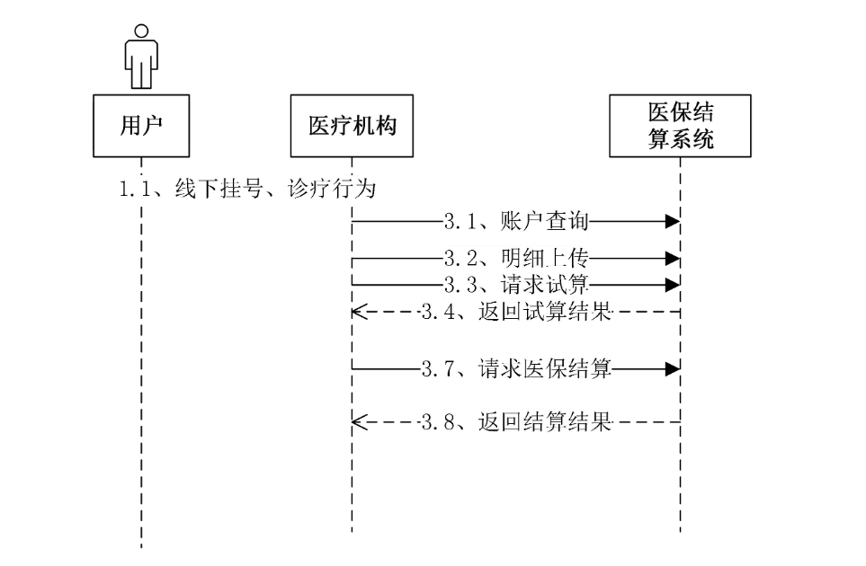
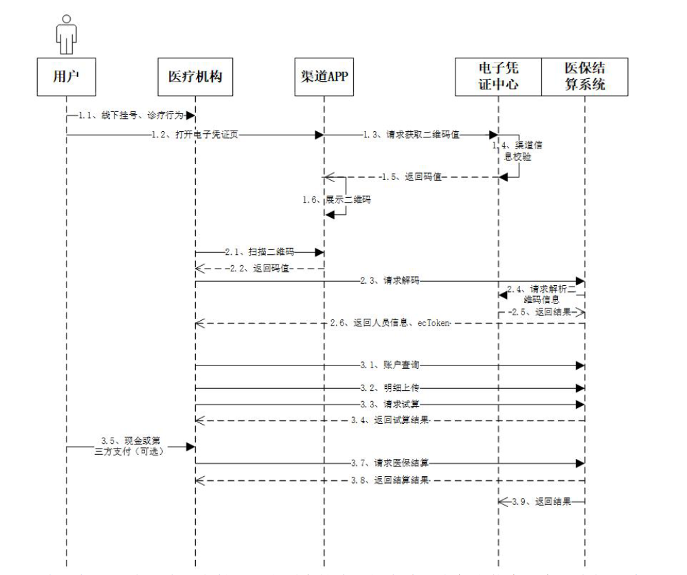
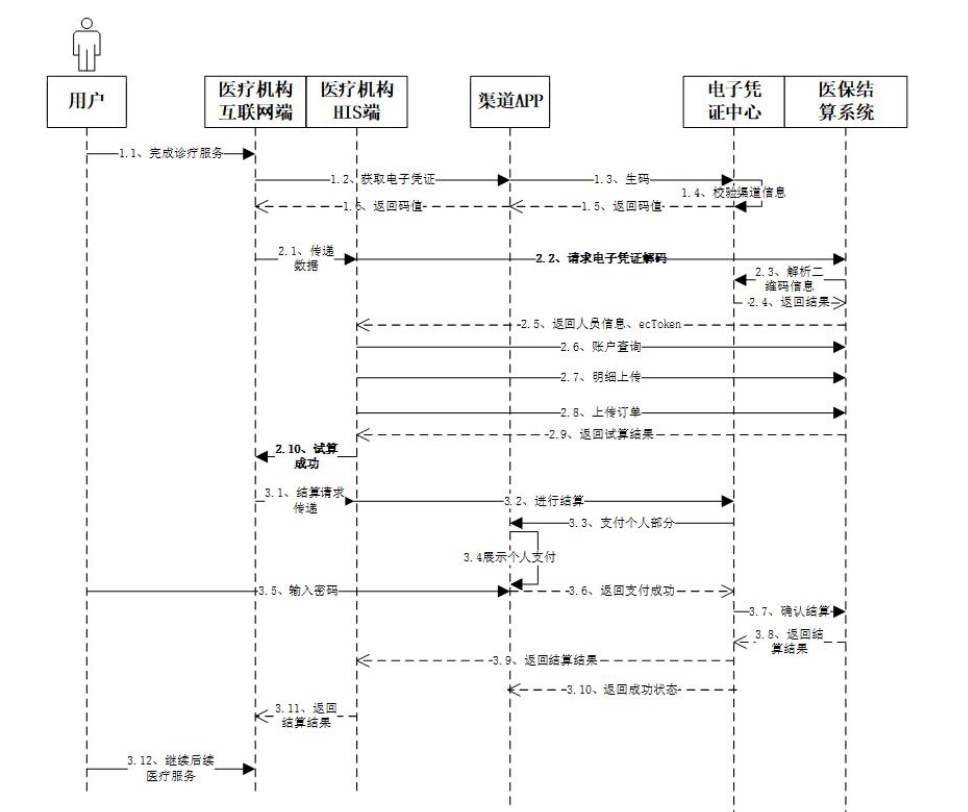
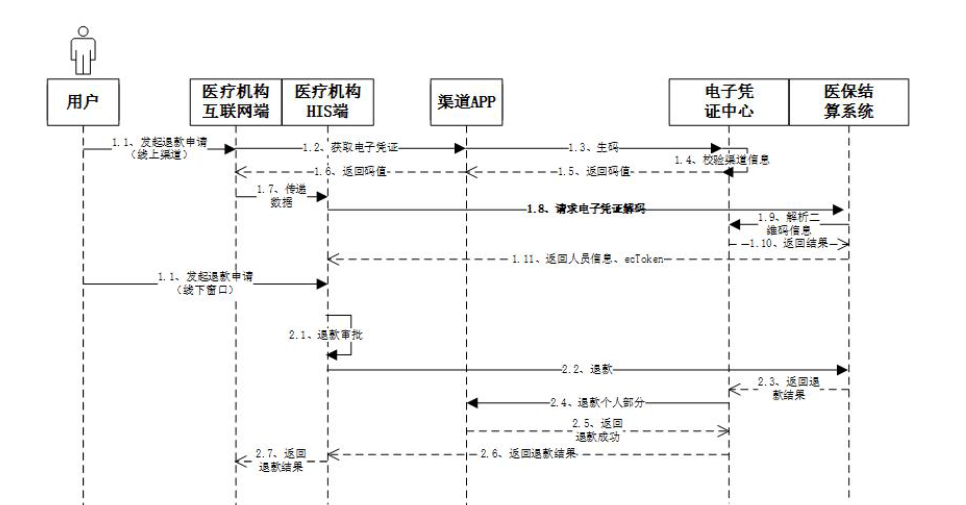
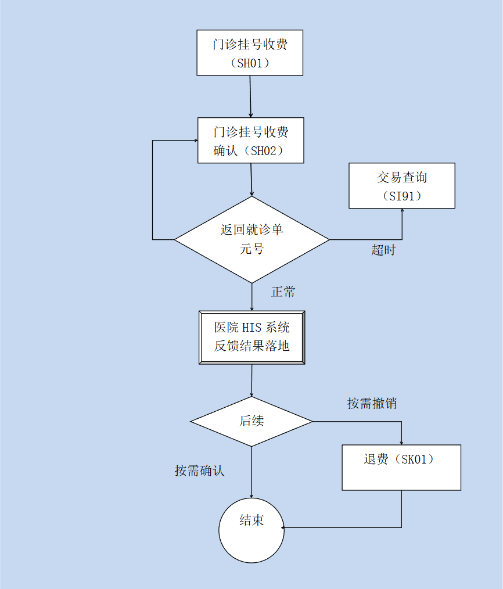
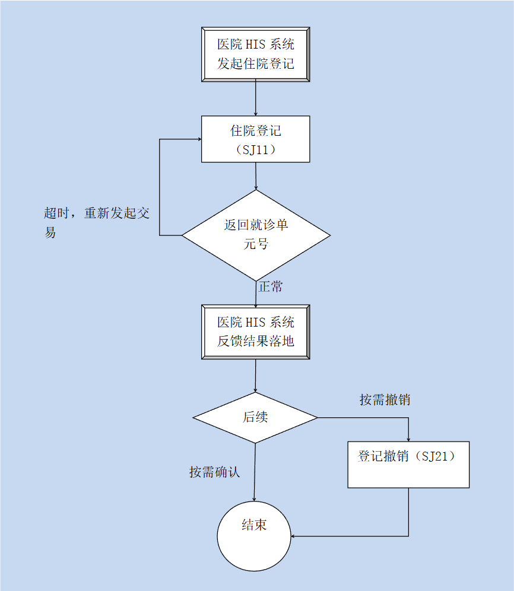
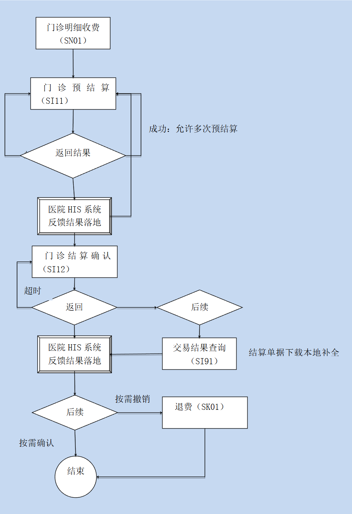
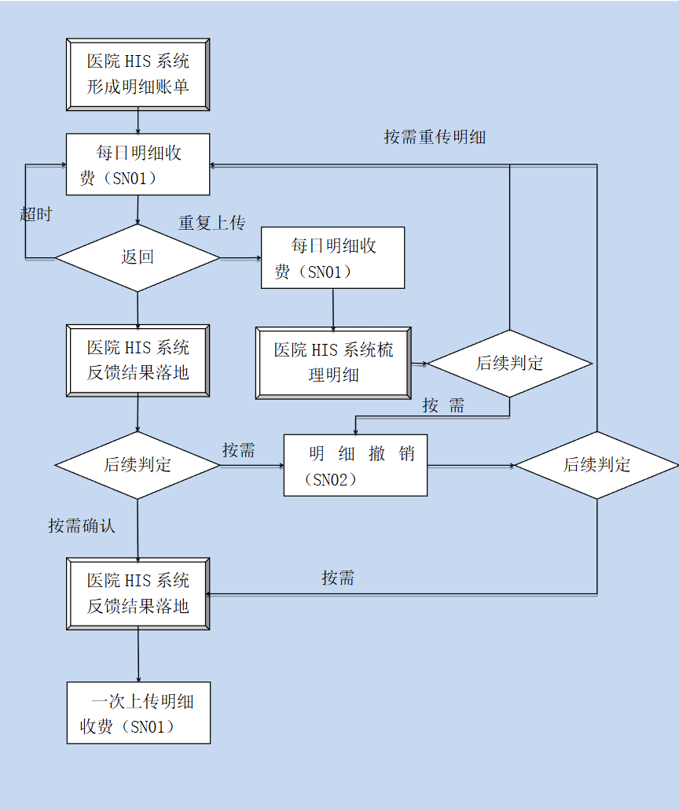
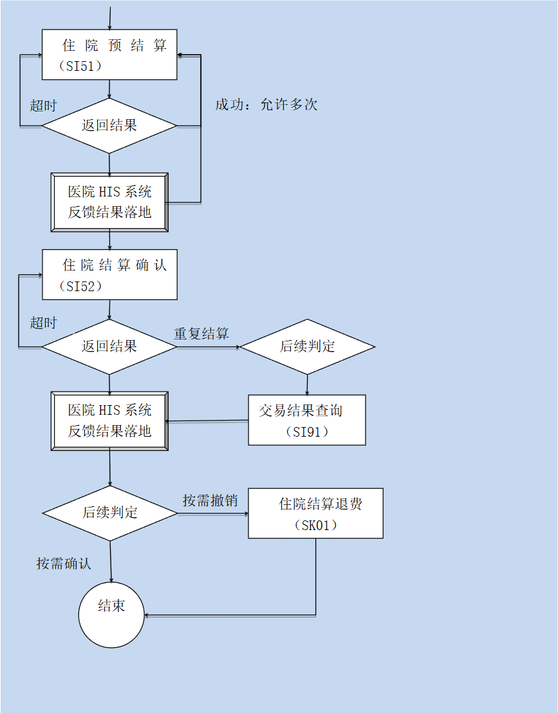

# 范（第五版-完整版）

> 本文档整合了 V1.0 基础版及 V1.0.1、V1.0.2、V1.0.4、V1.0.5 补充修订内容。

# 1.概述

上海市城镇基本医疗保险制度实施以来，现行的医院系统接口标准为医疗保险费用的结算审核发挥了良好的作用。从建立与完善医保制度的长效管理机制的目标出发，对医保费用的结算审核要求趋向于更为合理和具体。随着信息化技术、互联网业务的发展，进一步完善结算审核计算机管理系统，对现有的医保结算系统进行线上线下一体化的升级改造，对现有的医院系统接口标准进行细化调整及升级。特提出以下中心系统与医院系统的接口规范。要求各医疗机构严格执行。

## 1.1 相关要求

 定点医疗机构应按照本接口要求，按时准确地完成系统改造，更好的为市民服务。 定点医疗机构应充分重视信息安全，遵守国家、本市和医保部门的法律法规、规章要求和规范等，切实做好信息安全工作，充分保护就诊病人的隐私。在与第三方渠道进行人员认证和线上现金部分结算时，只能提供为完成医保结算必须的认证和线上结算现金部分等信息，不得提供额外的非必须信息。

## 1.2 接口规范设计原则

 数据结构灵活可变原则充分考虑医保政策调整，将医保中可变的数据信息按照数据列表形式弹性设计； 轻量级的数据格式并支持多语言开发原则接口数据采用JSON格式进行传输，数据的体积小，传递的速度快，支持Dephi、VisualBasic、ActionScript、 C、 C#、 ColdFusion、Java、JavaScript、 Perl、PHP、 Python、 Ruby等服务器端语言； 线上线下一体化原则从医保全局出发，建设电子凭证服务中心，支持线下线上开展一体化结算。线下针对医疗机构，同时兼容实体就医凭证（社保卡、医保卡）和电子就医凭证（二维码）的使用。针对线上第三方渠道结算，提供电子码生成和核验、电子凭证认证服务。

## 1.3 名词解释

### 1.3.1 就诊单元号（jzdyh）

就诊单元是指将医疗服务的过程按照一个特定的参数划分为相同的部分，每一个部分为一个就诊单元；为便于费用审核及财务核算等管理工作开展，就诊单元需要设置编号，并称为“就诊单元号”。 要求挂号的业务类型（门诊类）：门诊、急诊、门诊大病等 要求登记的业务类型（住院类）：家庭病床、急诊观察、住院等一般情况下，由挂号或者住院登记等交易操作生成。

### 1.3.2 费用结算单元、中心流水号（lsh）

医疗机构向中心系统要求进行结算确认时，形成一个“费用结算单元”，中心系统生成唯一的结算流水号，即“中心流水号”。门诊类挂号，在形成就诊单元的同时形成一个费用结算单元。在一个就诊单元中可允许进行多次费用结算交易，即多个“费用结算单元”；比如，门诊类交易中一次挂号可对应多次收费。

### 1.3.3 明细账单号（mxzdh）

一次结算交易包含的具体费用明细称为“明细账单”，账单编号称为“明细账单号”，“明细账单号”是由请求结算交易发起的，中心系统生成的，且在中心系统中是唯一的。“明细账单”是“费用结算单元”的组成部分，可用于一次完整的费用结算交易。一份“明细账单”涉及的费用明细汇总金额称为“明细账单之费用总额”。 因接口限制、就诊过程等原因，费用明细有可能无法一次性完成上传，因此，“明细账单号”还起到关联所有与本次结算交易相关的费用明细数据的作用 对于门诊类业务，中心系统按“明细账单号”完成费用结算，并与结算结果中的“中心流水号”对应 对于住院类业务，中心系统按“明细账单号”完成费用结算，并与结算结果中的“中心流水号”对应，在院结算后首次提交费用明细，明细账单号传空，重新获取新的明细账单号，就诊单元号不变。

### 1.3.4 费用明细单体序号（xh）

每个“明细账单”中具体的费用明细，由定点医疗机构本地系统依次编号，称为“费用明细单体序号”。费用明细单体序号为整数，从“1”开始顺序编列，在一个“明细账单”中保持唯一。

### 1.3.5 线上支付

通过互联网进行医保在线结算的医保支付模式，包括“互联网+”医疗服务试点，以及医院开展的脱卡挂号、诊间结算等业务。

### 1.3.6 医疗保障个人电子凭证

以下简称电子凭证。是为参保人在全国统一的医保信息平台中颁发的统一标识信息。医保电子凭证可与身份证、二维码、生物特征等相关联，支持所有医保相关业务，全国通用，跨渠道通用。

### 1.3.7 令牌（ecToken）

是指完成电子凭证有效性验证后，由电子凭证业务中台生成的鉴权令牌，该鉴权令牌由特定算法生成且限定有效时间（目前暂定有效时间5分钟）。超过限定有效时间导致结算失败的，需要重新申请电子凭证及令牌。

### 1.3.8 医保结算请求包（payRequest）

在线支付互联网线上结算（SE02）中，按线下结算确认请求格式的数据包，请求包的长度同线下返回的交易包长度。

### 1.3.9 医保结算返回包（payResponse）

在线支付支付结果推送（SE03）和支付结果查询（SE04）中，按线下结算的格式返回的数据包，返回包的长度同线下返回的交易包长度。

# 1.3.10现金

本接口规范中的现金指个人支付部分，指参保人在定点医药机构就医购药时，除医保基金支付费用外，需个人缴纳的费用。

# 2.交易流程

医保结算系统升级后，采用电子凭证的线上或线下交易见电子凭证使用流程。对具体就诊业务的接口调用顺序见挂号、登记和结算的详细接口调用流程。

## 2.1 持卡就医流程



## 2.2 电子凭证线下使用流程



电子凭证二维码线下支付，是由原来的线下插卡读取参保人信息，变更为扫码读取人员信息。1、用户打开渠道应用电子凭证二维码页，渠道应用向电子凭证中心获取二维码值，并展示二维码。2、医疗机构通过扫码设备获取用户的渠道二维码值发送至电子凭证中心解码，电子凭证中心解码完成返回人员信息、ecToken。3、医疗机构根据人员信息、ecToken做帐户查询、明细上传。再发起医保试算、结算。

## 2.3 电子凭证线上支付流程



基于电子凭证的医保线上支付，由医疗机构互联网端从对应渠道获取电子凭证二维码，通过电子凭证二维码验证个人身份，完成网上挂号、互联网诊疗支付等医保移动支付功能。1、参保人完成诊疗服务，在医疗机构互联网端选择医保支付，医疗机构互联网端将通过对应的渠道，授权获取电子凭证二维码值(渠道向电子凭证中心实时获取)。获取时，渠道商应依照国家局规范，进行人脸等实人认证。2、医疗机构互联网端将相关数据传递给 HIS 端，由 HIS系统向医保系统进行电子凭证的验证、获取ectoken、帐户查询等。3、医疗机构通过HIS系统进行明细上传以及请求试算（订单上传）等过程。4、试算完成后，医疗机构互联网端将通知医保电子凭证中心进行结算，电子凭证中心通过后台接口发送个人自负部分的数据到对应渠道，由渠道应用完成参保人自负支付，然后将结果通知到电子凭证中心，由电子凭证中心完成医保结算。最后将交易结果返回给医院HIS系统，再返回到互联网端，进行后续医疗服务。5、如果结算时个人部分为零，则不再调用渠道进行医保个人部分结算。

## 2.4 电子凭证线上退款流程



1、参保人在移动设备点击退款或者在窗口线下发起退款，医疗机构收到退款消息，校验该订单是否可以退款。2、医疗机构向医保端发起退款，其中线上渠道通过电子凭证，线下窗口则通过实体卡。医保结算系统收到退款请求，先发往医保结算系统进行医保退款，再返回电子凭证中心进行个人部分退款，最后将结果返回给医院HIS端。

## 2.5 门诊（大病）挂号登记流程



## 2.6 住院（急观家床）登记流程



## 2.7 门诊（大病家床）结算流程



## 2.8 住院（急观）结算流程





# 3.接口说明和定义

## 3.1 接口调用方式

1、 医保实时交易类接口统一采用通讯接口方式调用，具体调用方式为：

    1） 将要发送的消息内容进行编码(编码规则见“消息编码格式”)。

    2） 调用下述通信模块(DLL)，以函数参数的方式传递要发送的消息。

    DLL名：SendRcv4.dll函数名：SendRcv4

    参数1：启动参数(8位字符串) ，固定为：12345678

    参数2：发送的消息

    参数3：返回的消息

    返回值：返回的消息，同参数 3

    3） 接收到通信模块的返回消息后，根据此返回结果，进行后续处理。

2、 异步推送类接口调用方式：

    1） 接口说明

    线上支付业务，医保端将个人支付部分和医保结算都完成后的结果，将通过医院HIS前置机地址异步推送给医院端，医院在前置机上部署相应的服务（建议通过代理转发的形式，到医院内网进行服务处理）。首次推送未成功的情况下，往后每隔一分钟推送一次结果，推送结果将以医院端返回："xxfhm": "P001"结束推送。

    2） 接口地址医院HIS前置机配置的url服务地址；为了方便运维，接口地址需要在前置机转换如下的标准格式：http://[前置机IP]:8888/shyb/notify [ ]中为动态部分，其余为固定值。

    3） 请求方式http post [contenType=application/json]

## 3.2 消息编码格式

本接口规范数据的交互（接收与返回）采用JSON字符串格式。 接口中标注的长度均为最大长度，长度不足无需填写空格，字符编码采用UTF-8。可空字段如果没有内容，需保证数据节点存在，并用双引号填充。

### 3.2.1 报文结构

具体的报文结构如下：

| 字段   | 内容                | 最大长度 | 是否可空 | 说明                                                                                                                                                     |
| ------ | ------------------- | -------- | -------- | -------------------------------------------------------------------------------------------------------------------------------------------------------- |
| jysj   | 交易时间            | 19       | 非空     | 时间格式                                                                                                                                                 |
| xxlxm  | 消息类型码          | 7        | 非空     | 填具体的消息类型码，如SH01，SH02                                                                                                                         |
| xxfhm  | 交易返回码          | 4        | 可空     | P001代表成功，具体见3.4交易返 回码章节说明                                                                                                               |
| fhxx   | 交易返回信息        | 200      | 可空     | 交易返回的具体详细信息。                                                                                                                                 |
| bbh    | 交易版本号          | 4        | 可空     | 由医保控件读取，如0001                                                                                                                                   |
| msgid  | 报文ID              | 30       | 非空     | 医疗机构代码（11位）+日期（8位） +流水号（9位）                                                                                                          |
| xzqhdm | 发卡地行政区划 代码 | 6        | 可空     | 由 医保 控 件 读 取 ， 参 照 GB/T 2260-2007 中华人民共和国行政区 划代码（字典代码AAB301）, 地市 编码（例如： 310000 上海市）, 异地就医时为参保地行政区划 |
| jgdm   | 医疗机构代码        | 20       | 非空     | 医疗机构代码                                                                                                                                             |
| czybm  | 操作员编码          | 20       | 非空     | 医疗机构操作人员编码                                                                                                                                     |
| czyxm  | 操作员姓名          | 100      | 非空     | 最大长度为100字节                                                                                                                                        |
| xxnr   | 消息内容            | ……     | 非空     | 详见“消息格式”中入参和出参， 用{}包含                                                                                                                  |
| jyqd   | 交易渠道            | 2        | 非空     | 10=线下交易 20=线上交易                                                                                                                                  |
| jyyzm  | 交易验证码          | 100      | 可空     | 由医保控件读取,具体格式： PSAM卡芯片号码｜加密因子                                                                                                       |
| zdjbhs | 终端设备识别码      | 20       | 可空     | 若交易渠道非HIS刷卡，填写终端 设备识别码（如移动设备IMEI）；                                                                                             |

### 3.2.2 单条数据格式示例

以“SM01-帐户查询请求接口为例：

```json
{
    "jysj": "2020-01-01 12:00:00",
    "xxlxm": "SM01",
    "xxfhm": "",
    "fhxx": "",
    "bbh": "",
    "msgid": "9999999990020200101000000001",
    "xzqhdm": "310000",
    "jgdm": "99999999900",
    "czybm": "GH0001",
    "czyxm": "挂号收费终端",
    "xxnr": {
        "cardtype": "1",
        "carddata": "3100000022122200000031110"
    },
    "jyqd": "10",
    "jyyzm": "000000|ABC243DDESF",
    "zdjbhs": "E093F20947G001222"
}
```

### 3.2.3 多条数据格式示例

如明细上传交易SN01：

```json
{
    "jysj": "2020-01-01 12:00:00",
    "xxlxm": "SN01",
    "xxfhm": "00000000",
    "fhxx": "",
    "bbh": "V1.0",
    "msgid": "898989898",
    "xzqhdm": "310000",
    "jgdm": "13221230400",
    "czybm": "001",
    "czyxm": "测试员01",
    "xxnr": {
        "cardtype": "1",
        "carddata": "1300232324557045450164922510",
        "jzdyh": "20200000000001110320",
        "djh": "0110",
        "mxzdh": "20200000000001110320",
        "brlx": "0",
        "gsrdh": "",
        "bcmxylfyze": 13.39,
        "mxxms": [
            {
                "xh": 1,
                "cfh": "00001",
                "deptid": "01",
                "ksmc": "预防保健科",
                "cfysh": "238091",
                "cfysxm": "许X",
                "fylb": "12",
                "jslxbz": "120",
                "mxxmbm": "X00001250020010",
                "mxxmmc": "阿莫西林胶囊",
                "mxxmdw": "盒",
                "mxxmdj": 13.39,
                "mxxmsl": 1,
                "mxxmje": 13.39,
                "mxxmjyfy": 0,
                "mxxmybjsfwfy": 13.39,
                "yyclpp": "0",
                "zczh": "0",
                "mxxmgg": "250mg×24粒盒铝塑泡罩",
                "mxxmsyrq": "20200305",
                "bxbz": "0",
                "sftfbz": "1",
                "jfbz": "0",
                "sfxfmx": "0"
            }
        ]
    },
    "jyqd": "10",
    "jyyzm": "11",
    "zdsbsbm": "10"
}
```

## 3.3 数据项格式说明

### 3.3.1 字符串格式

格式：字符串 例如："操作人"，表示字符“操作人”

### 3.3.2 日期格式

格式：8位数字 例如："20200101"，表示2020年1月1日

### 3.3.3 年月格式

格式：6位数字 例如："202001"，表示2020年1月

### 3.3.4 时间格式

格式：yyyy-MM-dd HH:mm:ss（24小时进制）例如："2020-01-01 12:00:00"，表示2020年1月1日12点0分0秒

### 3.3.5 数字格式 A

用途：主要用于带小数的金额数据格式：整数部分 + 小数点 + 小数部分，按字符串格式上传。小数部分2位。一般指金额信息。例如： "456734.35"； "456734.20"；"456734.00"；"0.00"

### 3.3.6 数字格式 B

用途：主要用于次数、数量等不含小数的整数格式：整数，按字符串格式上传。例如："1"；"10"；"234"

### 3.3.7 数字格式 C

用途：主要用于带1位小数的数字，且小数部分只能为0或5，如住院天数。格式：整数部分 + 小数点 + 小数部分，按字符串格式上传。小数部分1位。例如： "0.5"； "2.5"；"15"；"265.0"

### 3.3.8 数字格式 D

用途：主要用于带4位小数的数字，如明细项目数量。格式：整数部分 + 小数点 + 小数部分，按字符串格式上传。小数部分4位。例如： "0.5001"； "2.5000"；"15.0000"；"265.0123"

### 3.3.9 数字格式 E

用途：主要用于带6位小数的数字，如明细项目单价。格式：整数部分 + 小数点 + 小数部分，按字符串格式上传。小数部分6位。例如： "0.501111"； "2.500111"；"15.000000"；"265.012311"

## 3.4 交易返回码

| 序号 | 交易返回码 | 交易返回码说明                               |
| ---- | ---------- | -------------------------------------------- |
| 1.   | P001       | 交易成功                                     |
| 2.   | S001       | 访问权限异常                                 |
| 3.   | A001       | 服务端数据访问异常                           |
| 4.   | A002       | 服务端应用程序异常                           |
| 5.   | C001       | 客户端报文解析错误                           |
| 6.   | C002       | 客户端报文数据格式错误                       |
| 7.   | S002       | 服务端业务处理控制提示                       |
| 8.   | E001       | 应用错误（详见交易返回信息）                 |
| 9.   | T100       | 通信失败，超时                               |
| 10.  | T002       | 通信失败，超时                               |
| 11.  | T004       | 通信失败，超时                               |
| 12.  | T099       | 通信失败，超时                               |
| 13.  | P100       | 数据错误（如：数字格式错误等）               |
| 14.  | P200       | 认证错误（如：医院代码不存在等）             |
| 15.  | P300       | 结算错误（如：卡已挂失等）                   |
| 16.  | P400       | 登记撤消错误（如：医院无此权限等）           |
| 17.  | P410       | 已处于登记状态，无须再次登记                 |
| 18.  | P420       | 未进行过相应登记                             |
| 19.  | P500       | 退款错误（如：未找到交易记录等）             |
| 20.  | P510       | 退款：该笔交易已经退款，不能重复退款         |
| 21.  | P600       | 交易查询错误（如：交易记录与医院代码不符等） |
| 22.  | P610       | 交易查询未找到相应记录                       |
| 23.  | P700       | 保障卡错误                                   |
| 24.  | P800       | 医院权限错误（如：医院无家床结算的权限）     |
| 25.  | P900       | 其他错误，具体信息从“系统提示信息”中获取   |
| 26.  | P010       | 警告信息                                     |

# 4.消息内容格式

## 4.1 消息类型表

| 序号 | 消息分类     | 消息类型码 | 说明                     | 交易方式 |
| ---- | ------------ | ---------- | ------------------------ | -------- |
| 1.   | 基本信息读取 | S000       | 保障卡基本信息读取       | 实时交易 |
| 2.   | 结算         | SH01       | 门诊类挂号               | 实时交易 |
| 3.   |              | SH02       | 门诊类挂号确认           | 实时交易 |
| 4.   |              | SI11       | 门诊类收费               | 实时交易 |
| 5.   |              | SI12       | 门诊类收费确认           | 实时交易 |
| 6.   |              | SI51       | 住院类收费               | 实时交易 |
| 7.   |              | SI52       | 住院类收费确认           | 实时交易 |
| 8.   | 反交易       | SK01       | 退款                     | 实时交易 |
| 9.   | 登记         | SJ11       | 登记业务                 | 实时交易 |
| 10.  |              | SJ21       | 登记撤消                 | 实时交易 |
| 11.  |              | SJ31       | 登记查询                 | 实时交易 |
| 12.  |              | SJ41       | 干保登记查询             | 实时交易 |
| 13.  |              | SJ51       | 民政帮困定点查询         | 实时交易 |
| 14.  |              | SJC1       | 居保门诊转院撤销         | 实时交易 |
| 15.  |              | SJD1       | 居保门诊转院查询         | 实时交易 |
| 16.  |              | SJF1       | 居保门诊转院             | 实时交易 |
| 17.  |              | SJH1       | 居保门诊转院转入医院查询 | 实时交易 |
| 18.  | 查询         | SL01       | 对帐                     | 实时交易 |
| 19.  |              | SM01       | 帐户查询                 | 实时交易 |
| 20.  |              | SI91       | 交易查询                 | 实时交易 |
| 21.  |              | SJG1       | 工伤认定号查询           | 实时交易 |
| 22.  | 明细上传     | SN01       | 明细账单提交             | 实时交易 |
| 23.  |              | SN02       | 明细账单撤销             | 实时交易 |
| 24.  | 线上支付     | SE01       | 解码                     | 实时交易 |
| 25.  |              | SE02       | 互联网线上结算           | 实时交易 |
| 26.  |              | SE03       | 支付结果推送             | 异步推送 |
| 27.  |              | SE04       | 支付结果查询             | 实时交易 |
| 28.  |              | SE05       | 现金退款结果推送         | 异步推送 |
| 29.  |              | SE06       | 现金退款结果查询         | 实时交易 |
| 30.  |              | SE07       | 现金退款提交             | 实时交易 |
| 31.  | 应急切换     | SYJ1       | 应急切换查询             | 实时交易 |

## 4.2 基本信息读取

### 4.2.1 S000-保障卡基本信息读取

#### 4.2.1.1 说明

获取保障卡基本信息。

#### 4.2.1.2 入参

无。

#### 4.2.1.3 出参

| 数据项 | 数据项说明   | 类型   | 最大 长度 | 是否可空 | 备注 |
| ------ | ------------ | ------ | --------- | -------- | ---- |
| kh     | 卡号         | 字符串 | 9         | 非空     |      |
| xm     | 姓名         | 字符串 | 50        | 非空     |      |
| xb     | 性别         | 字符串 | 1         | 非空     |      |
| sfzh   | 身份证号     | 字符串 | 18        | 非空     |      |
| lxdh   | 联系电话     | 字符串 | 15        | 可空     |      |
| txdz   | 通信地址     | 字符串 | 80        | 可空     |      |
| yzbm   | 邮政编码     | 字符串 | 6         | 可空     |      |
| xzqh   | 行政区划代码 | 字符串 | 6         | 非空     |      |

## 4.3 结算

### 4.3.1 SH01-门诊类挂号

#### 4.3.1.1 说明

门诊类挂号。

#### 4.3.1.2 入参

| 数据项        | 数据项说明             | 类型      | 最大 长度 | 是否可空 | 备注                                          |
| ------------- | ---------------------- | --------- | --------- | -------- | --------------------------------------------- |
| cardtype      | 凭证类别               | 字符串    | 1         | 非空     | 0：磁卡，1：保障卡，2：身份证件，3：电子凭证  |
| carddata      | 凭证码                 | 字符串    | 63        | 非空     | 磁卡：28位，保障卡：不填，电子凭证：填写令牌  |
| deptid        | 科室编码               | 字符串    | 50        | 非空     | 见字典表                                      |
| zlxmdm        | 诊疗项目代码           | 字符串    | 50        | 非空     |                                               |
| personspectag | 特殊人员标识           | 字符串    | 1         | 非空     | 0：普通，1：离休，2： 伤残，3：干部保健定点   |
| yllb          | 医疗类别               | 字符串    | 3         | 非空     | 见字典表                                      |
| dbtype        | 大病项目代码           | 字符串    | 1         | 可空     | 见字典表                                      |
| persontype    | 病人类型               | 字符串    | 1         | 非空     | 0：一般病人； 1：工伤；                       |
| gsrdh         | 工伤认定号             | 字符串    | 10        | 可空     |                                               |
| totalexpense  | 交易费用总额           | 数字格式A |           | 非空     |                                               |
| ybjsfwfyze    | 医保结算范围费用总额   | 数字格式A |           | 非空     | 工伤病人填写工伤结算范围费用总额              |
| zhenlf        | 诊疗费                 | 数字格式A |           | 非空     |                                               |
| ghf           | 门（急）诊诊疗费自费   | 数字格式A |           | 非空     |                                               |
| fybjsfwfyze   | 非医保结算范围费用总额 | 数字格式A |           | 非空     | 工伤病人填写非工伤结算范围费用总额            |
| jmbz          | 享受社区减免标 志      | 字符串    | 1         | 非空     | 0：不享受 1：享受 非减免机构无需填 写         |
| xsywlx        | 线上业务类型           | 字符串    | 1         | 可空     | 1：一般线上交易 2：互联网医院诊疗线上交易必填 |
|               |                        |           |           |          |                                               |

#### 4.3.1.3 出参

| 数据项        | 数据项说明             | 类型      | 最大 长度 | 是否可空 | 备注                                           |
| ------------- | ---------------------- | --------- | --------- | -------- | ---------------------------------------------- |
| cardtype      | 凭证类别               | 字符串    | 1         | 非空     | 0：磁卡，1：保障卡，2：身份证件，3：电子凭证   |
| cardid        | 卡号                   | 字符串    | 50        | 可空     |                                                |
| personname    | 姓名                   | 字符串    | 50        | 非空     |                                                |
| personspectag | 特殊人员标识           | 字符串    | 1         | 非空     | 0：普通，1：离休，2： 伤残，3：干部保健定点    |
| accountattr   | 帐户标志               | 字符串    | 16        | 非空     | 见字典表                                       |
| jmjsbz        | 减免结算标志           | 字符串    | 1         | 非空     | 0：正常结算，1：医保减免结算，2：财 政减免结算 |
| totalexpense  | 交易费用总额           | 数字格式A |           | 非空     |                                                |
| curaccountpay | 当年帐户支付数         | 数字格式A |           | 非空     |                                                |
| hisaccountpay | 历年帐户支付数         | 数字格式A |           | 非空     |                                                |
| zfdxjzfs      | 自负段现金支付数       | 数字格式A |           | 非空     |                                                |
| zfdlnzhzfs    | 自负段历年帐户 支付数  | 数字格式A |           | 非空     |                                                |
| tcdzhzfs      | 统筹段帐户支付数       | 数字格式A |           | 非空     |                                                |
| tcdxjzfs      | 统筹段现金支付数       | 数字格式A |           | 非空     |                                                |
| tczfs         | 统筹支付数             | 数字格式A |           | 非空     | 工伤病人返回工伤基金支付数                     |
| fjdzhzfs      | 附加段帐户支付         | 数字格式A |           | 非空     |                                                |
| fjdxjzfs      | 附加段现金支付数       | 数字格式A |           | 非空     |                                                |
| fjzfs         | 附加支付数             | 数字格式A |           | 非空     |                                                |
| curaccountamt | 当年帐户余额           | 数字格式A |           | 非空     |                                                |
| hisaccountamt | 历年帐户余额           | 数字格式A |           | 非空     |                                                |
| ybjsfwfyze    | 医保结算范围费用总额   | 数字格式A |           | 非空     | 工伤病人返回工伤结算范围费用总额               |
| fybjsfwfyze   | 非医保结算范围费用总额 | 数字格式A |           | 非空     | 工伤病人返回非工伤结算范围费用总额             |
| jssqxh        | 计算申请序号           | 字符串    | 34        | 可空     |                                                |
| jlc           | 记录册号               | 字符串    | 12        | 可空     |                                                |
| jfje          | 其中：减负金额         | 数字格式A |           | 可空     |                                                |

> **说明：**
> 1 交易费用总额 = 当年帐户支付数 + 历年帐户支付数 + 自负段现金支付数 + 自负段历年帐户支付数 + 统筹段帐户支付数 + 统筹段现金支付数 + 统筹支付数 + 附加段帐户支付数 + 附加段现金支付数 + 附加支付数 = 医保结算范围费用总额2 如符合财政减免的病人，减免金额体现在“非医保结算范围个人自费”。

### 4.3.2 SH02-门诊类挂号确认

#### 4.3.2.1 说明

门诊挂号确认。

#### 4.3.2.2 入参

| 数据项        | 数据项说明             | 类型      | 最大 长度 | 是否可空 | 备注                                          |
| ------------- | ---------------------- | --------- | --------- | -------- | --------------------------------------------- |
| cardtype      | 凭证类别               | 字符串    | 1         | 非空     | 0：磁卡，1：保障卡，2：身份证件，3：电子凭证  |
| carddata      | 凭证码                 | 字符串    | 63        | 非空     | 磁卡：28位，保障卡：不填，电子凭证：填写令牌  |
| deptid        | 科室编码               | 字符串    | 50        | 非空     | 见字典表                                      |
| zlxmdm        | 诊疗项目代码           | 字符串    | 50        | 非空     |                                               |
| personspectag | 特殊人员标识           | 字符串    | 1         | 非空     | 0：普通，1：离休，2： 伤残，3：干部保健定点   |
| yllb          | 医疗类别               | 字符串    | 3         | 非空     | 见字典表                                      |
| dbtype        | 大病项目代码           | 字符串    | 1         | 可空     | 见字典表                                      |
| persontype    | 病人类型               | 字符串    | 1         | 非空     | 0：一般病人； 1：工伤；                       |
| gsrdh         | 工伤认定号             | 字符串    | 10        | 可空     |                                               |
| jssqxh        | 计算申请序号           | 字符串    | 34        | 非空     |                                               |
| totalexpense  | 交易费用总额           | 数字格式A |           | 非空     |                                               |
| ybjsfwfyze    | 医保结算范围费用总额   | 数字格式A |           | 非空     | 工伤病人填写工伤结算范围费用总额              |
| zhenlf        | 诊疗费                 | 数字格式A |           | 非空     |                                               |
| ghf           | 门（急）诊诊疗费自费   | 数字格式A |           | 非空     |                                               |
| fybjsfwfyze   | 非医保结算范围费用总额 | 数字格式A |           | 非空     | 工伤病人填写非工伤结算范围费用总额            |
| jmbz          | 享受社区减免标志       | 字符串    | 1         | 非空     | 0：不享受 1：享受 非减免机构无需填 写         |
| xsywlx        | 线上业务类型           | 字符串    | 1         | 可空     | 1：一般线上交易 2：互联网医院诊疗线上交易必填 |

> **说明：**
> 若是线上交易，则上传SE02，其中医保结算确认请求包（payRequest）使用此入参定义。

#### 4.3.2.3 出参

| 数据项        | 数据项说明             | 类型       | 最大 长度 | 是否可空 | 备注                                            |
| ------------- | ---------------------- | ---------- | --------- | -------- | ----------------------------------------------- |
| cardtype      | 凭证类别               | 字符串     | 1         | 非空     | 0：磁卡，1：保障卡，3：电子凭证                 |
| cardid        | 卡号                   | 字符串     | 50        | 可空     |                                                 |
| jzdyh         | 就诊单元号             | 字符串     | 20        | 非空     |                                                 |
| lsh           | 中心流水号             | 字符串     | 16        | 非空     |                                                 |
| jssqxh        | 计算申请序号           | 字符串     | 34        | 非空     |                                                 |
| jmjsbz        | 减免结算标志           | 字符串     | 1         | 非空     | 0：正常结算，1： 医保减免结算，2： 财政减免结算 |
| totalexpense  | 交易费用总额           | 数字格式 A |           | 非空     |                                                 |
| curaccountpay | 当年帐户支付数         | 数字格式 A |           | 非空     |                                                 |
| hisaccountpay | 历年帐户支付数         | 数字格式 A |           | 非空     |                                                 |
| zfdxjzfs      | 自负段现金支付数       | 数字格式 A |           | 非空     |                                                 |
| zfdlnzhzfs    | 自负段历年帐户支付数   | 数字格式 A |           | 非空     |                                                 |
| tcdzhzfs      | 统筹段帐户支付数       | 数字格式 A |           | 非空     |                                                 |
| tcdxjzfs      | 统筹段现金支付数       | 数字格式 A |           | 非空     |                                                 |
| tczfs         | 统筹支付数             | 数字格式A  |           | 非空     | 工伤病人返回工伤基金支付数                      |
| fjdzhzfs      | 附加段帐户支付数       | 数字格式 A |           | 非空     |                                                 |
| fjdxjzfs      | 附加段现金支付数       | 数字格式 A |           | 非空     |                                                 |
| fjzfs         | 附加支付数             | 数字格式 A |           | 非空     |                                                 |
| curaccountamt | 当年帐户余额           | 数字格式 A |           | 非空     |                                                 |
| hisaccountamt | 历年帐户余额           | 数字格式 A |           | 非空     |                                                 |
| ybjsfwfyze    | 医保结算范围费用总额   | 数字格式 A |           | 非空     | 工伤病人返回工伤结算范围费用 总额               |
| fybjsfwfyze   | 非医保结算范围费用总额 | 数字格式 A |           | 非空     | 工伤病人返回非 工伤结算范围费用总额             |
| jlc           | 记录册号               | 字符串     | 12        | 可空     |                                                 |
| jfje          | 其中：减负金额         | 数字格式 A |           | 可空     |                                                 |

> **说明：**
> 1 交易费用总额 = 当年帐户支付数 + 历年帐户支付数 + 自负段现金支付数 + 自负段历年帐户支付数 + 统筹段帐户支付数 + 统筹段现金支付数 + 统筹支付数 + 附加段帐户支付数 + 附加段现金支付数 + 附加支付数 = 医保结算范围费用总额2 如符合财政减免的病人，减免金额体现在“非医保结算范围个人自费”。3 若是线上交易，则异步推送支付结果（SE03），其中医保结算确认返回包（payResponse）使用此出参定义。

### 4.3.3 SI11-门诊类收费

#### 4.3.3.1 说明

门诊类收费。

#### 4.3.3.2 入参

| 数据项        | 数据项说明             | 类型      | 最大 长度 | 是否可空 | 备注                                          |
| ------------- | ---------------------- | --------- | --------- | -------- | --------------------------------------------- |
| cardtype      | 凭证类别               | 字符串    | 1         | 非空     | 0：磁卡，1：保障卡，2：身份证件，3：电子凭证  |
| carddata      | 凭证码                 | 字符串    | 63        | 非空     | 磁卡：28位，保障卡：不填，电子凭证：填写令牌  |
| deptid        | 科室编码               | 字符串    | 50        | 非空     | 见字典表                                      |
| personspectag | 特殊人员标识           | 字符串    | 1         | 非空     | 0：普通，1：离休，2： 伤残，3：干部保健定点   |
| yllb          | 医疗类别               | 字符串    | 3         | 非空     | 见字典表                                      |
| persontype    | 病人类型               | 字符串    | 1         | 非空     | 0：一般病人； 1：工伤；                       |
| gsrdh         | 工伤认定号             | 字符串    | 10        | 可空     |                                               |
| zdnos         | 诊断编码循环体开始     |           |           |          |                                               |
| zdno          | 诊断编码               | 字符串    | 30        | 非空     |                                               |
| zdmc          | 诊断名称               | 字符串    | 50        | 非空     |                                               |
|               | 诊断编码循环体结束     |           |           |          |                                               |
| dbtype        | 大病项目代码           | 字符串    | 1         | 可空     | 见字典表                                      |
| jsksrq        | 家床结算开始日 期      | 日期格式  |           | 可空     | 家床结算时填写                                |
| jsjsrq        | 家床结算结束日 期      | 日期格式  |           | 可空     | 家床结算时填写                                |
| jzcs          | 家床就诊次数           | 数字格式B |           | 可空     | 家床结算时填写                                |
| jzdyh         | 就诊单元号             | 字符串    | 20        | 非空     |                                               |
| xsywlx        | 线上业务类型           | 字符串    | 1         | 可空     | 1：一般线上交易 2：互联网医院诊疗线上交易必填 |
| mxzdhs        | 明细账单号循环列表开始 |           |           |          |                                               |
| mxzdh         | 明细账单号             | 字符串    | 20        | 非空     |                                               |
| totalexpense  | 交易费用总额           | 数字格式A |           | 非空     |                                               |
| ybjsfwfyze    | 医保结算范围费用总额   | 数字格式A |           | 非空     | 工伤病人填写工伤结算范围费用总额              |
| fybjsfwfyze   | 非医保结算范围费用总额 | 数字格式A |           | 非空     | 工伤病人填写非工伤结算范围费用总额            |
|               | 明细账单号循环列表结束 |           |           |          |                                               |

#### 4.3.3.3 出参

| 数据项        | 数据项说明             | 类型      | 最大 长度 | 是否可空 | 备注                                         |
| ------------- | ---------------------- | --------- | --------- | -------- | -------------------------------------------- |
| cardtype      | 凭证类别               | 字符串    | 1         | 非空     | 0：磁卡，1：保障卡，2：身份证件，3：电子凭证 |
| cardid        | 卡号                   | 字符串    | 50        | 可空     |                                              |
| personname    | 姓名                   | 字符串    | 50        | 非空     |                                              |
| personspectag | 特殊人员标识           | 字符串    | 1         | 非空     | 0：普通，1：离休，2： 伤残，3：干部保健定点  |
| accountattr   | 帐户标志               | 字符串    | 16        | 非空     | 见字典表                                     |
| totalexpense  | 交易费用总额           | 数字格式A |           | 非空     |                                              |
| curaccountpay | 当年帐户支付数         | 数字格式A |           | 非空     |                                              |
| hisaccountpay | 历年帐户支付数         | 数字格式A |           | 非空     |                                              |
| zfdxjzfs      | 自负段现金支付数       | 数字格式A |           | 非空     |                                              |
| zfdlnzhzfs    | 自负段历年帐户 支付数  | 数字格式A |           | 非空     |                                              |
| tcdzhzfs      | 统筹段帐户支付数       | 数字格式A |           | 非空     |                                              |
| tcdxjzfs      | 统筹段现金支付数       | 数字格式A |           | 非空     |                                              |
| tczfs         | 统筹支付数             | 数字格式A |           | 非空     | 工伤病人返回工伤基金支付数                   |
| fjdzhzfs      | 附加段帐户支付数       | 数字格式A |           | 非空     |                                              |
| fjdxjzfs      | 附加段现金支付数       | 数字格式A |           | 非空     |                                              |
| fjzfs         | 附加支付数             | 数字格式A |           | 非空     |                                              |
| curaccountamt | 当年帐户余额           | 数字格式A |           | 非空     |                                              |
| hisaccountamt | 历年帐户余额           | 数字格式A |           | 非空     |                                              |
| ybjsfwfyze    | 医保结算范围费用总额   | 数字格式A |           | 非空     | 工伤病人返回工伤结算范围费用总额             |
| fybjsfwfyze   | 非医保结算范围费用总额 | 数字格式A |           | 非空     | 工伤病人返回非工伤结算范围费用总额           |
| jssqxh        | 计算申请序号           | 字符串    | 34        | 可空     |                                              |
| jlc           | 记录册号               | 字符串    | 12        | 可空     |                                              |
| jfje          | 其中：减负金额         | 数字格式A |           | 可空     |                                              |

> **说明：**
> 1 交易费用总额 = 当年帐户支付数 + 历年帐户支付数 + 自负段现金支付数 + 自负段历年帐户支付数 + 统筹段帐户支付数 + 统筹段现金支付数 + 统筹支付数 + 附加段帐户支付数 + 附加段现金支付数 + 附加支付数

### 4.3.4 SI12-门诊类收费确认

#### 4.3.4.1 说明

门诊类收费确认。

#### 4.3.4.2 入参

| 数据项        | 数据项说明             | 类型      | 最大 长度 | 是否可空 | 备注                                          |
| ------------- | ---------------------- | --------- | --------- | -------- | --------------------------------------------- |
| cardtype      | 凭证类别               | 字符串    | 1         | 非空     | 0：磁卡，1：保障卡，2：身份证件，3：电子凭证  |
| carddata      | 凭证码                 | 字符串    | 63        | 非空     | 磁卡：28位，保障卡：不填，电子凭证：填写令牌  |
| deptid        | 科室编码               | 字符串    | 50        | 非空     | 见字典表                                      |
| personspectag | 特殊人员标识           | 字符串    | 1         | 非空     | 0：普通，1：离休，2： 伤残，3：干部保健定点   |
| yllb          | 医疗类别               | 字符串    | 3         | 非空     | 见字典表                                      |
| persontype    | 病人类型               | 字符串    | 1         | 非空     | 0：一般病人； 1：工伤；                       |
| gsrdh         | 工伤认定号             | 字符串    | 10        | 可空     |                                               |
| zdnos         | 诊断编码循环体开始     |           |           |          |                                               |
| zdno          | 诊断编码               | 字符串    | 30        | 非空     |                                               |
| zdmc          | 诊断名称               | 字符串    | 50        | 非空     |                                               |
|               | 诊断编码循环体结束     |           |           |          |                                               |
| dbtype        | 大病项目代码           | 字符串    | 1         | 可空     | 见字典表                                      |
| jsksrq        | 家床结算开始 日期      | 日期格式  |           | 可空     | 家床结算时填写                                |
| jsjsrq        | 家床结算结束 日期      | 日期格式  |           | 可空     | 家床结算时填写                                |
| jzcs          | 家床就诊次数           | 数字格式B |           | 可空     | 家床结算时填写                                |
| jzdyh         | 就诊单元号             | 字符串    | 20        | 非空     |                                               |
| xsywlx        | 线上业务类型           | 字符串    | 1         | 可空     | 1：一般线上交易 2：互联网医院诊疗线上交易必填 |
| jssqxh        | 计算申请序号           | 字符串    | 34        | 非空     |                                               |
| mxzdhs        | 明细账单号循环列表开始 |           |           |          |                                               |
| mxzdh         | 明细账单号             | 字符串    | 20        | 非空     |                                               |
| totalexpense  | 交易费用总额           | 数字格式A |           | 非空     |                                               |
| ybjsfwfyze    | 医保结算范围费用总额   | 数字格式A |           | 非空     | 工伤病人填写工伤结算范围费用总额              |
| fybjsfwfyze   | 非医保结算范围费用总额 | 数字格式A |           | 非空     | 工伤病人填写非工伤结算范围费用总额            |
|               | 明细账单号循环列表结束 |           |           |          |                                               |

> **说明：**
> 1 若是线上交易，则上传SE02，其中医保结算确认请求包（payRequest）使用此入参定义。

#### 4.3.4.3 出参

| 数据项        | 数据项说明             | 类型      | 最大 长度 | 是否可空 | 备注                                         |
| ------------- | ---------------------- | --------- | --------- | -------- | -------------------------------------------- |
| cardtype      | 凭证类别               | 字符串    | 1         | 非空     | 0：磁卡，1：保障卡，2：身份证件，3：电子凭证 |
| cardid        | 卡号                   | 字符串    | 50        | 可空     |                                              |
| lsh           | 中心流水号             | 字符串    | 16        | 非空     |                                              |
| jssqxh        | 计算申请序号           | 字符串    | 34        | 非空     |                                              |
| totalexpense  | 交易费用总额           | 数字格式A |           | 非空     |                                              |
| curaccountpay | 当年帐户支付数         | 数字格式A |           | 非空     |                                              |
| hisaccountpay | 历年帐户支付数         | 数字格式A |           | 非空     |                                              |
| zfdxjzfs      | 自负段现金支付数       | 数字格式A |           | 非空     |                                              |
| zfdlnzhzfs    | 自负段历年帐户 支付数  | 数字格式A |           | 非空     |                                              |
| tcdzhzfs      | 统筹段帐户支付数       | 数字格式A |           | 非空     |                                              |
| tcdxjzfs      | 统筹段现金支付数       | 数字格式A |           | 非空     |                                              |
| tczfs         | 统筹支付数             | 数字格式A |           | 非空     | 工伤病人返回工伤基金支付数                   |
| fjdzhzfs      | 附加段帐户支付数       | 数字格式A |           | 非空     |                                              |
| fjdxjzfs      | 附加段现金支付数       | 数字格式A |           | 非空     |                                              |
| fjzfs         | 附加支付数             | 数字格式A |           | 非空     |                                              |
| curaccountamt | 当年帐户余额           | 数字格式A |           | 非空     |                                              |
| hisaccountamt | 历年帐户余额           | 数字格式A |           | 非空     |                                              |
| ybjsfwfyze    | 医保结算范围费用总额   | 数字格式A |           | 非空     | 工伤病人返回工伤结算范围费用总额             |
| fybjsfwfyze   | 非医保结算范围费用总额 | 数字格式A |           | 非空     | 工伤病人返回非工伤结算范围费用总额           |
| jlc           | 记录册号               | 字符串    | 12        | 可空     |                                              |
| jfje          | 其中：减负金额         | 数字格式A |           | 可空     |                                              |

> **说明：**
> 1 交易费用总额 = 当年帐户支付数 + 历年帐户支付数 + 自负段现金支付数 + 自负段历年帐户支付数 + 统筹段帐户支付数 + 统筹段现金支付数 + 统筹支付数 + 附加段帐户支付数 + 附加段现金支付数 + 附加支付数2 若是线上交易，则异步推送支付结果（SE03），其中医保结算确认返回包（payResponse）使用此出参定义。

### 4.3.5 SI51-住院类收费

#### 4.3.5.1 说明

住院类收费。

#### 4.3.5.2 入参

| 数据项        | 数据项说明             | 类型      | 最大 长度 | 是否可空 | 备注                                          |
| ------------- | ---------------------- | --------- | --------- | -------- | --------------------------------------------- |
| cardtype      | 凭证类别               | 字符串    | 1         | 非空     | 0：磁卡，1：保障卡，2：身份证件，3：电子凭证  |
| carddata      | 凭证码                 | 字符串    | 63        | 非空     | 磁卡：28位，保障卡：不填，电子凭证：填写令牌  |
| personspectag | 特殊人员标识           | 字符串    | 1         | 非空     | 0：普通，1：离休，2： 伤残，3：干部保健定点   |
| yllb          | 医疗类别               | 字符串    | 3         | 非空     | 见字典表                                      |
| persontype    | 病人类型               | 字符串    | 1         | 非空     | 0：一般病人； 1：工伤；                       |
| gsrdh         | 工伤认定号             | 字符串    | 10        | 可空     |                                               |
| cyjsbz        | 出院结算标志           | 字符串    | 1         | 非空     | 0：出院（出观）结 算 1：在院结算              |
| jsksrq        | 结算开始日期           | 日期格式  | 8         | 非空     |                                               |
| jsjsrq        | 结算结束日期           | 日期格式  | 8         | 非空     |                                               |
| zyts          | 住院/急观天数          | 数字格式C |           | 非空     | 仅用一位小数，且只 存在0.5和0.0               |
| zyh           | 住院号/急观号          | 字符串    | 16        | 可空     |                                               |
| deptid        | 科室编码               | 字符串    | 50        | 非空     | 见字典表                                      |
| zdnos         | 诊断编码循环体开始     |           |           |          |                                               |
| zdno          | 诊断编码               | 字符串    | 30        | 非空     |                                               |
| zdmc          | 诊断名称               | 字符串    | 50        | 非空     |                                               |
|               | 诊断编码循环体结束     |           |           |          |                                               |
| jzdyh         | 就诊单元号             | 字符串    | 20        | 非空     |                                               |
| xsywlx        | 线上业务类型           | 字符串    | 1         | 可空     | 1：一般线上交易 2：互联网医院诊疗线上交易必填 |
| mxzdhs        | 明细账单号循环列表开始 |           |           |          |                                               |
| mxzdh         | 明细账单号             | 字符串    | 20        | 非空     |                                               |
| totalexpense  | 交易费用总额           | 数字格式A |           | 非空     |                                               |
| ybjsfwfyze    | 医保结算范围费用总额   | 数字格式A |           | 非空     |                                               |
| fybjsfwfyze   | 非医保结算范围费用总额 | 数字格式A |           | 非空     |                                               |
|               | 明细账单号循环列表结束 |           |           |          |                                               |

#### 4.3.5.3 出参

| 数据项        | 数据项说明             | 类型      | 最大 长度 | 是否可空 | 备注                                         |
| ------------- | ---------------------- | --------- | --------- | -------- | -------------------------------------------- |
| cardtype      | 凭证类别               | 字符串    | 1         | 可空     | 0：磁卡，1：保障卡，2：身份证件，3：电子凭证 |
| cardid        | 卡号                   | 字符串    | 50        | 可空     |                                              |
| personname    | 姓名                   | 字符串    | 50        | 非空     |                                              |
| accountattr   | 帐户标志               | 字符串    | 16        | 非空     | 见字典表                                     |
| totalexpense  | 交易费用总额           | 数字格式A |           | 非空     |                                              |
| qfdzhzfs      | 起付段帐户支付数       | 数字格式A |           | 非空     |                                              |
| tcdzhzfs      | 统筹段帐户支付数       | 数字格式A |           | 非空     |                                              |
| fjdzhzfs      | 附加段帐户支付数       | 数字格式A |           | 非空     |                                              |
| qfdxjzfs      | 起付段现金支付数       | 数字格式A |           | 非空     |                                              |
| tcdxjzfs      | 统筹段现金支付数       | 数字格式A |           | 非空     |                                              |
| fjdxjzfs      | 附加段现金支付数       | 数字格式A |           | 非空     |                                              |
| tczfs         | 统筹支付数             | 数字格式A |           | 非空     | 工伤病人返回工伤基金支付数                   |
| fjzfs         | 附加支付数             | 数字格式A |           | 非空     |                                              |
| curaccountamt | 当年帐户余额           | 数字格式A |           | 非空     |                                              |
| hisaccountamt | 历年帐户余额           | 数字格式A |           | 非空     |                                              |
| ybjsfwfyze    | 医保结算范围费用总额   | 数字格式A |           | 非空     |                                              |
| fybjsfwfyze   | 非医保结算范围费用总额 | 数字格式A |           | 非空     |                                              |
| jssqxh        | 计算申请序号           | 字符串    | 34        | 可空     |                                              |
| jfje          | 其中：减负金额         | 数字格式A |           | 可空     |                                              |

> **说明：**
> 1 交易费用总额 = 起付段帐户支付数 + 统筹段帐户支付数 + 附加段帐户支付数 + 起付段现金支付数 + 统筹段现金支付数 + 附加段现金支付数 + 统筹支付数 + 附加支付数

### 4.3.6 SI52-住院类收费确认

#### 4.3.6.1 说明

住院类收费确认。

#### 4.3.6.2 入参

| 数据项        | 数据项说明             | 类型      | 最大 长度 | 是否可空 | 备注                                          |
| ------------- | ---------------------- | --------- | --------- | -------- | --------------------------------------------- |
| cardtype      | 凭证类别               | 字符串    | 1         | 非空     | 0：磁卡，1：保障卡，3：电子凭证               |
| carddata      | 凭证码                 | 字符串    | 63        | 非空     | 磁卡：28位，保障卡：不填，电子凭证：填写令牌  |
| personspectag | 特殊人员标识           | 字符串    | 1         | 非空     | 0：普通 1：离休 2：伤残 3：干部 保健定点      |
| yllb          | 医疗类别               | 字符串    | 3         | 非空     | 见字典表                                      |
| persontype    | 病人类型               | 字符串    | 1         | 非空     | 0：一般病人； 1：工伤；                       |
| gsrdh         | 工伤认定号             | 字符串    | 10        | 可空     |                                               |
| cyjsbz        | 出院结算标志           | 字符串    | 1         | 非空     | 0：出院结算 1：在 院结算                      |
| jsksrq        | 结算开始日期           | 日期格式  | 8         | 非空     |                                               |
| jsjsrq        | 结算结束日期           | 日期格式  | 8         | 非空     |                                               |
| zyts          | 住院/急观天数          | 数字格式C |           | 非空     | 仅用一位小数，且 只存在0.5和0.0               |
| zyh           | 住院号                 | 字符串    | 16        |          |                                               |
| deptid        | 科室编码               | 字符串    | 50        | 非空     | 见字典表                                      |
| zdnos         | 诊断编码循环体开始     |           |           |          |                                               |
| zdno          | 诊断编码               | 字符串    | 30        |          |                                               |
| zdmc          | 诊断名称               | 字符串    | 50        |          |                                               |
|               | 诊断编码循环体结束     |           |           |          |                                               |
| jzdyh         | 就诊单元号             | 字符串    | 20        | 非空     |                                               |
| xsywlx        | 线上业务类型           | 字符串    | 1         | 可空     | 1：一般线上交易 2：互联网医院诊疗线上交易必填 |
| jssqxh        | 计算申请序号           | 字符串    | 34        | 可空     |                                               |
| mxzdhs        | 明细账单号循环列表开始 |           |           |          |                                               |
| mxzdh         | 明细账单号             | 字符串    |           | 非空     |                                               |
| totalexpense  | 交易费用总额           | 数字格式A |           | 非空     |                                               |
| ybjsfwfyze    | 医保结算范围费用总额   | 数字格式A |           | 非空     |                                               |
| fybjsfwfyze   | 非医保结算范围费用总额 | 数字格式A |           | 非空     |                                               |
|               | 明细账单号循环列表结束 |           |           |          |                                               |

> **说明：**
> 1 若是线上交易，则上传SE02，其中医保结算确认请求包（payRequest）使用此入参定义。

#### 4.3.6.3 出参

| 数据项        | 数据项说明             | 类型       | 最大 长度 | 是否可空 | 备注                            |
| ------------- | ---------------------- | ---------- | --------- | -------- | ------------------------------- |
| cardtype      | 凭证类别               | 字符串     | 1         | 可空     | 0：磁卡，1：保障卡，3：电子凭证 |
| cardid        | 卡号                   | 字符串     | 50        | 可空     |                                 |
| lsh           | 中心流水号             | 字符串     | 16        | 非空     |                                 |
| jssqxh        | 计算申请序号           | 字符串     | 34        | 非空     |                                 |
| totalexpense  | 交易费用总额           | 数字格式 A |           | 非空     |                                 |
| qfdzhzfs      | 起付段帐户支付数       | 数字格式 A |           | 非空     |                                 |
| tcdzhzfs      | 统筹段帐户支付数       | 数字格式 A |           | 非空     |                                 |
| fjdzhzfs      | 附加段帐户支付数       | 数字格式 A |           | 非空     |                                 |
| qfdxjzfs      | 起付段现金支付数       | 数字格式 A |           | 非空     |                                 |
| tcdxjzfs      | 统筹段现金支付数       | 数字格式 A |           | 非空     |                                 |
| fjdxjzfs      | 附加段现金支付数       | 数字格式 A |           | 非空     |                                 |
| tczfs         | 统筹支付数             | 数字格式 A |           | 非空     | 工伤病人返回工伤基金支付数      |
| fjzfs         | 附加支付数             | 数字格式 A |           | 非空     |                                 |
| curaccountamt | 当年帐户余额           | 数字格式 A |           | 非空     |                                 |
| hisaccountamt | 历年帐户余额           | 数字格式 A |           | 非空     |                                 |
| ybjsfwfyze    | 医保结算范围费用总额   | 数字格式 A |           | 非空     |                                 |
| fybjsfwfyze   | 非医保结算范围费用总额 | 数字格式 A |           | 非空     |                                 |
| jfje          | 其中：减负金额         | 数字格式 A |           | 可空     |                                 |

> **说明：**
> 1 交易费用总额 = 起付段帐户支付数 + 统筹段帐户支付数 + 附加段帐户支付数 + 起付段现金支付数 + 统筹段现金支付数 + 附加段现金支付数 + 统筹支付数 + 附加支付数2 若是线上交易，则异步推送支付结果（SE03），其中医保结算确认返回包（payResponse）使用此出参定义。

## 4.4 反交易

### 4.4.1 SK01-退款

#### 4.4.1.1 说明

退款。

#### 4.4.1.2 入参

| 数据项       | 数据项说明   | 类型      | 最大 长度 | 是否可空 | 备注                                          |
| ------------ | ------------ | --------- | --------- | -------- | --------------------------------------------- |
| cardtype     | 凭证类别     | 字符串    | 1         | 非空     | 0：磁卡，1：保障卡，2：身份证件，3：电子凭证  |
| carddata     | 凭证码       | 字符串    | 63        | 非空     | 磁卡：28位，保障卡：不填，电子凭证：填写令牌  |
| translsh     | 中心流水号   | 字符串    | 16        | 非空     |                                               |
| totalexpense | 交易费用总额 | 数字格式A |           | 非空     |                                               |
| xsywlx       | 线上业务类型 | 字符串    | 1         | 可空     | 1：一般线上交易 2：互联网医院诊疗线上交易必填 |

#### 4.4.1.3 出参

| 数据项         | 数据项说明        | 类型       | 最大 长度 | 是否可空 | 备注                                         |
| -------------- | ----------------- | ---------- | --------- | -------- | -------------------------------------------- |
| cardtype       | 凭证类别          | 字符串     | 1         | 非空     | 0：磁卡，1：保障卡，2：身份证件，3：电子凭证 |
| cardid         | 卡号              | 字符串     | 50        | 非空     |                                              |
| personname     | 姓名              | 字符串     | 50        | 非空     |                                              |
| accountattr    | 帐户标志          | 字符串     | 16        | 非空     | 见字典表                                     |
| translsh       | 中心流水号        | 字符串     | 16        | 非空     |                                              |
| curaccount     | 当年帐户退 回数   | 数字格式 A |           | 非空     |                                              |
| hisaccount     | 历年帐户退 回数   | 数字格式 A |           | 非空     |                                              |
| zfcash         | 自负段现金 退回数 | 数字格式 A |           | 非空     |                                              |
| tchisaccount   | 统筹段帐户 退回数 | 数字格式 A |           | 非空     |                                              |
| tccash         | 统筹段现金 退回数 | 数字格式 A |           | 非空     |                                              |
| tc             | 统筹退回数        | 数字格式 A |           | 非空     | 工伤病人返回退回工伤基金支付数               |
| dffjhisaccount | 附加段帐户 退回数 | 数字格式 A |           | 非空     |                                              |
| dffjcash       | 附加段现金 退回数 | 数字格式 A |           | 非空     |                                              |
| dffj           | 附加退回数        | 数字格式 A |           | 非空     |                                              |
| curaccountamt  | 当年帐户余 额     | 数字格式 A |           | 非空     |                                              |
| hisaccountamt  | 历年帐户余 额     | 数字格式 A |           | 非空     |                                              |

## 4.5 登记

### 4.5.1 SJ11-登记业务

#### 4.5.1.1 说明

登记。

#### 4.5.1.2 入参

| 数据项    | 数据项说明                | 类型     | 最大 长度 | 是否可空 | 备注                                                                                                            |
| --------- | ------------------------- | -------- | --------- | -------- | --------------------------------------------------------------------------------------------------------------- |
| cardtype  | 凭证类别                  | 字符串   | 1         | 非空     | 0：磁卡，1：保障卡，2：身份证件，3：电子凭证                                                                    |
| carddata  | 凭证码                    | 字符串   | 63        | 非空     | 磁卡：28位，保障卡：不填，电子凭证：填写令牌                                                                    |
| deptid    | 科室编码                  | 字符串   | 50        | 非空     | 见字典表                                                                                                        |
| djtype    | 登记类别                  | 字符串   | 1         | 非空     | 1：家床建床 2：急观入观 3：入院登记 4：大病登记 6：保健对象急观 7：保健 对象入院0：门诊登记A： 保健对象门诊登记 |
| djno      | 登记号                    | 字符串   | 16        | 非空     | 急观：填急观号，住院： 填住院号，家床：填空格， 大病：填空格                                                    |
| startdate | 开始日期                  | 日期格式 | 8         | 非空     | 格式：“YYYYMMDD” 家床：家床开始日期 急观：急观开始日期 住院：住院开始日期 大病：大病开始日期                  |
| enddate   | 结束日期                  | 日期格式 | 8         | 可空     | 格式：“YYYYMMDD” 家床：家床结束日期 急观：空格 住院：空格 大病：空格（默认6个月）                             |
| zdnos     | 诊断编码循环体开始        |          |           |          |                                                                                                                 |
| zdno      | 诊断编码                  | 字符串   | 30        | 非空     |                                                                                                                 |
| zdmc      | 诊断名称                  | 字符串   | 50        |          |                                                                                                                 |
|           | 诊断编码循环体结束        |          |           |          |                                                                                                                 |
| dbxm      | 大病项目                  | 字符串   | 1         | 可空     | 大病专用                                                                                                        |
| zd        | 门诊大病登记 疾病诊断分类 | 字符串   | 3         | 可空     | 大病专用，见字典表                                                                                              |
| wtrxm     | 大病登记委托 人姓名       | 字符串   | 50        | 可空     | 大病专用                                                                                                        |
| wtrsfzh   | 大病登记委托 人身份证     | 字符串   | 18        | 可空     | 大病专用                                                                                                        |
| yy        | 大病登记原因              | 字符串   | 1         | 可空     | 1：医疗原因；2：房屋动 迁；3：购买新房；4：暂 时与子女或其他亲属同 住；5：其他；                                |
| des       | 大病登记描述              | 字符串   | 100       | 可空     |                                                                                                                 |
| dbzl      | 大病登记子类              | 字符串   | 1         | 可空     | 1：特指内分泌特异抗肿瘤 治疗；0：其它                                                                           |
| ysxm      | 大病登记医师 姓名         | 字符串   | 50        | 可空     |                                                                                                                 |
| ysgh      | 大病登记医师 工号         | 字符串   | 20        | 可空     |                                                                                                                 |

> **说明：**
> 1 门诊登记 对于特殊情况下不需要挂号的门诊收费，调用此接口并在登记类别中上传门诊登记以获取就诊单元号进行后续的门急诊收费结算。

#### 4.5.1.3 出参

| 数据项        | 数据项说明                | 类型      | 最大 长度 | 是否可空 | 备注                                         |
| ------------- | ------------------------- | --------- | --------- | -------- | -------------------------------------------- |
| cardtype      | 凭证类别                  | 字符串    | 1         | 非空     | 0：磁卡，1：保障卡，2：身份证件，3：电子凭证 |
| cardid        | 卡号                      | 字符串    | 50        | 非空     |                                              |
| jzdyh         | 就诊单元号                | 字符串    | 20        | 非空     | 大病登记时为空                               |
| personname    | 姓名                      | 字符串    | 50        | 非空     |                                              |
| sfzh          | 身份证号                  | 字符串    | 18        | 非空     |                                              |
| rysx          | 人员属性                  | 字符串    | 1         | 可空     | 0：城保；                                    |
| gzqk          | 职退情况                  | 字符串    | 1         | 非空     | 1：在职；2：退休； 0：其他                   |
| zcyymc        | 大病登记转出医 疗机构名称 | 字符串    | 50        | 可空     | 大病登记专用                                 |
| startdate     | 开始日期                  | 日期格式  | 8         | 可空     | yyyymmdd                                     |
| enddate       | 结束日期                  | 日期格式  | 8         | 可空     | yyyymmdd                                     |
| lsh           | 登记流水号                | 字符串    | 16        | 可空     | 大病登记返回打印回 执用                      |
| curaccountamt | 当年帐户余额              | 数字格式A |           | 非空     |                                              |
| hisaccountamt | 历年帐户余额              | 数字格式A |           | 非空     |                                              |

### 4.5.2 SJ21-登记撤销

#### 4.5.2.1 说明

登记撤销。

#### 4.5.2.2 入参

| 数据项   | 数据项说明   | 类型   | 最大 长度 | 是否可空 | 备注                                                                             |
| -------- | ------------ | ------ | --------- | -------- | -------------------------------------------------------------------------------- |
| cardtype | 凭证类别     | 字符串 | 1         | 非空     | 0：磁卡，1：保障卡，2：身份证件，3：电子凭证                                     |
| carddata | 凭证码       | 字符串 | 63        | 非空     | 磁卡：28位，保障卡：不填，电子凭证：填写令牌                                     |
| cxtype   | 撤销类别     | 字符串 | 1         | 非空     | 1：家床撤床 2：急观出观 3：入院撤消 4：大病撤销 6：保健对象急观 7：保健 对象入院 |
| dbxm     | 撤销大病项目 | 字符串 | 1         | 可空     |                                                                                  |

#### 4.5.2.3 出参

| 数据项        | 数据项说明   | 类型      | 最大 长度 | 是否可空 | 备注                                         |
| ------------- | ------------ | --------- | --------- | -------- | -------------------------------------------- |
| cardtype      | 凭证类别     | 字符串    | 1         | 非空     | 0：磁卡，1：保障卡，2：身份证件，3：电子凭证 |
| cardid        | 卡号         | 字符串    | 50        | 非空     |                                              |
| personname    | 姓名         | 字符串    | 50        | 非空     |                                              |
| accountattr   | 帐户标志     | 字符串    | 16        | 非空     | 见字典表                                     |
| curaccountamt | 当年帐户余额 | 数字格式A |           | 非空     |                                              |
| hisaccountamt | 历年帐户余额 | 数字格式A |           | 非空     |                                              |

### 4.5.3 SJ31-登记查询

#### 4.5.3.1 说明

登记查询。

#### 4.5.3.2 入参

| 数据项   | 数据项说明 | 类型   | 最大 长度 | 是否可空 | 备注                                                                                   |
| -------- | ---------- | ------ | --------- | -------- | -------------------------------------------------------------------------------------- |
| cardtype | 凭证类别   | 字符串 | 1         | 非空     | 0：磁卡，1：保障卡，2：身份证件，3：电子凭证                                           |
| carddata | 凭证码     | 字符串 | 63        | 非空     | 磁卡：28位，保障卡：不填，电子凭证：填写令牌                                           |
| djlb     | 登记类别   | 字符串 | 1         | 非空     | 1：家床 2：急观 3：住院 4： 大病5：本院定点 6：保健 对象急观 7：保健对象住院 9：造口袋 |

#### 4.5.3.3 出参

| 数据项        | 数据项说明       | 类型      | 最大 长度 | 是否可空 | 备注                                                                                                            |
| ------------- | ---------------- | --------- | --------- | -------- | --------------------------------------------------------------------------------------------------------------- |
| cardtype      | 凭证类别         | 字符串    | 1         | 非空     | 0：磁卡，1：保障卡，2：身份证件，3：电子凭证                                                                    |
| cardid        | 卡号             | 字符串    | 50        | 非空     |                                                                                                                 |
| personname    | 姓名             | 字符串    | 50        | 非空     |                                                                                                                 |
| accountattr   | 帐户标志         | 字符串    | 16        | 非空     | 见字典表                                                                                                        |
| djxxs         | 登记信息循环开始 |           |           |          |                                                                                                                 |
| jzdyh         | 就诊单元号       | 字符串    | 20        | 非空     |                                                                                                                 |
| djtype        | 登记类别         | 字符串    | 1         |          | 1：家床 2：急观 3：住院 4：大病5：本院定点 9：造口袋                                                            |
| djno          | 登记号           | 字符串    | 16        |          | 急观：急观号，住院：住院号，其他：填空格                                                                        |
| startdate     | 开始日期         | 日期格式  | 8         | 非空     | 格式：“YYYYMMDD” 家床：家床开始日期 急观：入观开始日期 住院：入院开始日期 大病：开始日期 造口袋：登记开始日期 |
| enddate       | 结束日期         | 日期格式  | 8         | 可空     | 格式：“YYYYMMDD” 家床：家床结束日期 急观：空格 住院：空格 大病：结束日期 造口袋：登记结束日期                 |
| zdno          | 诊断编码         | 字符串    | 30        | 可空     | 若为大病，则填写：门诊 大病登记疾病诊断分类； 其他：诊断编码                                                    |
| dbtype        | 大病项目代码     | 字符串    | 1         | 可空     | 若为大病，则填写大病项 目代码；其他：空格                                                                       |
| dbzl          | 大病登记子类     | 字符串    | 1         | 可空     | 1：特指内分泌特异抗肿 瘤治疗；0：其它                                                                           |
| djhossame     | 登记医院标志     | 字符串    | 1         | 可空     | 0：本院，1：其他医院                                                                                            |
| djhosname     | 登记医院名称     | 字符串    | 50        | 可空     |                                                                                                                 |
|               | 登记信息循环结束 |           |           |          |                                                                                                                 |
| curaccountamt | 当年帐户余额     | 数字格式A |           | 非空     |                                                                                                                 |
| hisaccountamt | 历年帐户余额     | 数字格式A |           | 非空     |                                                                                                                 |
| zkdbnye       | 本年度剩余额 度  | 数字格式A |           | 可空     | 本年度剩下可使用的造 口袋额度                                                                                   |

### 4.5.4 SJ41-干保登记查询

#### 4.5.4.1 说明

干保登记查询。

#### 4.5.4.2 入参

| 数据项   | 数据项说明 | 类型   | 最大 长度 | 是否可空 | 备注                                         |
| -------- | ---------- | ------ | --------- | -------- | -------------------------------------------- |
| cardtype | 凭证类别   | 字符串 | 1         | 非空     | 0：磁卡，1：保障卡，2：身份证件，3：电子凭证 |
| carddata | 凭证码     | 字符串 | 63        | 非空     | 磁卡：28位，保障卡：不填，电子凭证：填写令牌 |

#### 4.5.4.3 出参

| 数据项      | 数据项说明   | 类型     | 最大 长度 | 是否可空 | 备注                                         |
| ----------- | ------------ | -------- | --------- | -------- | -------------------------------------------- |
| cardtype    | 凭证类别     | 字符串   | 1         | 非空     | 0：磁卡，1：保障卡，2：身份证件，3：电子凭证 |
| cardid      | 卡号         | 字符串   | 50        | 非空     |                                              |
| personname  | 姓名         | 字符串   | 50        | 非空     |                                              |
| accountattr | 帐户标志     | 字符串   | 16        | 非空     | 见字典表                                     |
| ddhossame   | 是否本院定点 | 字符串   | 1         | 可空     | 0：非本院定点；1：本院定 点；2：本院转诊     |
| zzqsrq      | 转诊起始日期 | 日期格式 | 8         | 可空     | 如果是本院转诊，则填写， 否则返回空格        |
| zzjsrq      | 转诊结束日期 | 日期格式 | 8         | 可空     | 如果是本院转诊，则填写， 否则返回空格        |

### 4.5.5 SJ51-民政帮困定点查询

#### 4.5.5.1 说明

民政帮困定点查询。

#### 4.5.5.2 入参

| 数据项   | 数据项说明 | 类型   | 最大 长度 | 是否可空 | 备注                                         |
| -------- | ---------- | ------ | --------- | -------- | -------------------------------------------- |
| cardtype | 凭证类别   | 字符串 | 1         | 非空     | 0：磁卡，1：保障卡，2：身份证件，3：电子凭证 |
| carddata | 凭证码     | 字符串 | 63        | 非空     | 磁卡：28位，保障卡：不填，电子凭证：填写令牌 |

#### 4.5.5.3 出参

| 数据项      | 数据项说明       | 类型   | 最大 长度 | 是否可空 | 备注                                         |
| ----------- | ---------------- | ------ | --------- | -------- | -------------------------------------------- |
| cardtype    | 凭证类别         | 字符串 | 1         | 非空     | 0：磁卡，1：保障卡，2：身份证件，3：电子凭证 |
| cardid      | 卡号             | 字符串 | 50        | 非空     |                                              |
| personname  | 姓名             | 字符串 | 50        | 非空     |                                              |
| accountattr | 帐户标志         | 字符串 | 16        | 非空     | 见字典表                                     |
| ddhossame   | 民政医疗帮困定点 | 字符串 | 1         | 可空     | 0：非本院定点，1：本院定点                   |

### 4.5.6 SJC1-居保门诊转院撤销

#### 4.5.6.1 说明

居保门诊转院撤销。

#### 4.5.6.2 入参

| 数据项    | 数据项说明            | 类型     | 最大 长度 | 是否可空 | 备注                                         |
| --------- | --------------------- | -------- | --------- | -------- | -------------------------------------------- |
| cardtype  | 凭证类别              | 字符串   | 1         | 非空     | 0：磁卡，1：保障卡，2：身份证件，3：电子凭证 |
| carddata  | 凭证码                | 字符串   | 63        | 非空     | 磁卡：28位，保障卡：不填，电子凭证：填写令牌 |
| djtype    | 撤消类别              | 字符串   | 1         | 非空     | 1:门诊转院登记撤消                           |
| zcjgdm    | 转出医院编码          | 字符串   | 9         | 非空     |                                              |
| zrjgdm    | 转入医院编码          | 字符串   | 9         | 非空     |                                              |
| startdate | 门诊转院日期 开始日期 | 日期格式 | 8         | 非空     |                                              |

#### 4.5.6.3 出参

| 数据项      | 数据项说明 | 类型   | 最大 长度 | 是否可空 | 备注                                         |
| ----------- | ---------- | ------ | --------- | -------- | -------------------------------------------- |
| cardtype    | 凭证类别   | 字符串 | 1         | 非空     | 0：磁卡，1：保障卡，2：身份证件，3：电子凭证 |
| cardid      | 卡号       | 字符串 | 50        | 非空     |                                              |
| personname  | 姓名       | 字符串 | 50        | 非空     |                                              |
| accountattr | 帐户标志   | 字符串 | 16        | 非空     | 见字典表                                     |

### 4.5.7 SJD1-居保门诊转院查询

#### 4.5.7.1 说明

居保门诊转院查询。

#### 4.5.7.2 入参

| 数据项   | 数据项说明 | 类型   | 最大 长度 | 是否可空 | 备注                                         |
| -------- | ---------- | ------ | --------- | -------- | -------------------------------------------- |
| cardtype | 凭证类别   | 字符串 | 1         | 非空     | 0：磁卡，1：保障卡，2：身份证件，3：电子凭证 |
| carddata | 凭证码     | 字符串 | 63        | 非空     | 磁卡：28位，保障卡：不填，电子凭证：填写令牌 |
| djtype   | 登记类别   | 字符串 | 1         |          | 1:门诊转院登记                               |

#### 4.5.7.3 出参

| 数据项           | 数据项说明       | 类型     | 最大 长度 | 是否可空 | 备注                                         |
| ---------------- | ---------------- | -------- | --------- | -------- | -------------------------------------------- |
| cardtype         | 凭证类别         | 字符串   | 1         | 非空     | 0：磁卡，1：保障卡，2：身份证件，3：电子凭证 |
| cardid           | 卡号             | 字符串   | 50        | 非空     |                                              |
| personname       | 姓名             | 字符串   | 50        | 非空     |                                              |
| djtype           | 类别             | 字符串   | 1         | 非空     | 1:门诊转院登记                               |
| zzxxs            | 转诊信息循环开始 |          |           |          |                                              |
| zcjgdm           | 转出医院编码     | 字符串   | 9         | 可空     |                                              |
| zcjgmc           | 转出医院名称     | 字符串   | 50        | 可空     |                                              |
| zrjgdm           | 转入医院编码     | 字符串   | 9         | 可空     |                                              |
| zrjgmc           | 转入医院名称     | 字符串   | 50        | 可空     |                                              |
| startdate        | 门诊转院日期     | 日期格式 | 8         | 可空     |                                              |
| 转诊信息循环结束 |                  |          |           |          |                                              |

### 4.5.8 SJF1-居保门诊转院

#### 4.5.8.1 说明

居保门诊转院。

#### 4.5.8.2 入参

| 数据项    | 数据项说明        | 类型     | 最大 长度 | 是否可空 | 备注                                         |
| --------- | ----------------- | -------- | --------- | -------- | -------------------------------------------- |
| cardtype  | 凭证类别          | 字符串   | 1         | 非空     | 0：磁卡，1：保障卡，2：身份证件，3：电子凭证 |
| carddata  | 凭证码            | 字符串   | 63        | 非空     | 磁卡：28位，保障卡：不填，电子凭证：填写令牌 |
| djtype    | 登记类别          | 字符串   | 1         | 非空     | 1:门诊转院登记                               |
| djno      | 登记号            | 字符串   | 16        | 非空     |                                              |
| startdate | 门诊转院 开始日期 | 日期格式 | 8         | 非空     |                                              |
| zrjgbh    | 转入医院编码      | 字符串   | 3         | 非空     |                                              |

#### 4.5.8.3 出参

| 数据项      | 数据项说明 | 类型   | 最大 长度 | 是否可空 | 备注                                         |
| ----------- | ---------- | ------ | --------- | -------- | -------------------------------------------- |
| cardtype    | 凭证类别   | 字符串 | 1         | 非空     | 0：磁卡，1：保障卡，2：身份证件，3：电子凭证 |
| cardid      | 卡号       | 字符串 | 50        | 非空     |                                              |
| personname  | 姓名       | 字符串 | 50        | 非空     |                                              |
| accountattr | 帐户标志   | 字符串 | 16        | 非空     | 见字典表                                     |

### 4.5.9 SJH1-居保门诊转院转入医院查询

#### 4.5.9.1 说明

居保门诊转院转入医院查询。

#### 4.5.9.2 入参

无。

#### 4.5.9.3 出参

| 数据项 | 数据项说明           | 类型   | 最大 长度 | 是否可空 | 备注 |
| ------ | -------------------- | ------ | --------- | -------- | ---- |
| zrjgs  | 转入医院信息循环开始 |        |           |          |      |
| zrjgbh | 转入医院编码         | 字符串 | 3         | 非空     |      |
| zrjgmc | 转入医院名称         | 字符串 | 50        | 非空     |      |
|        | 转入医院信息循环结束 |        |           |          |      |

## 4.6 查询

### 4.6.1 SL01-对账

#### 4.6.1.1 说明

总额对账。

#### 4.6.1.2 入参

| 数据项         | 数据项说明                 | 类型      | 最大 长度 | 是否可空 | 备注 |
| -------------- | -------------------------- | --------- | --------- | -------- | ---- |
| daycollate     | 对帐日                     | 日期格式  | 8         | 非空     |      |
| daycount       | 对帐日中心流水号数量       | 数字格式B |           | 非空     |      |
| totalcuraccpay | 当年帐户支付总额           | 数字格式A |           | 非空     |      |
| totalhisaccpay | 历年帐户支付总额           | 数字格式A |           | 非空     |      |
| totalcashpay   | 现金自负总额               | 数字格式A |           | 非空     |      |
| totaltcpay     | 统筹支付总额               | 数字格式A |           | 非空     |      |
| totaldffjpay   | 附加支付总额               | 数字格式A |           | 非空     |      |
| totalflzf      | 分类自负总额               | 数字格式A |           | 非空     |      |
| totalfybjsfw   | 非医保结算范围费用总额总额 | 数字格式A |           | 非空     |      |

> **说明：**
> 1 中心流水号数量包括收费和退费。

#### 4.6.1.3 出参

| 数据项        | 数据项说明 | 类型     | 最大 长度 | 是否可空 | 备注                                                                                                                          |
| ------------- | ---------- | -------- | --------- | -------- | ----------------------------------------------------------------------------------------------------------------------------- |
| daycollate    | 对帐日     | 日期格式 | 8         | 非空     |                                                                                                                               |
| resultcollate | 对账结果   | 字符串   | 1         | 可空     | 0：金额不符，交易明细未生 成 1 ：金额不符，交易明细已 生成，可以下载 2：此次对帐通过 3：对帐已通过，不需再次对 帐 4：改帐通过 |

### 4.6.2 SM01-帐户查询

#### 4.6.2.1 说明

帐户查询。

#### 4.6.2.2 入参

| 数据项   | 数据项说明 | 类型   | 最大 长度 | 是否可空 | 备注                                         |
| -------- | ---------- | ------ | --------- | -------- | -------------------------------------------- |
| cardtype | 凭证类别   | 字符串 | 1         | 非空     | 0：磁卡，1：保障卡，2：身份证件，3：电子凭证 |
| carddata | 凭证码     | 字符串 | 63        | 非空     | 磁卡：28位，保障卡：不填，电子凭证：填写令牌 |

#### 4.6.2.3 出参

| 数据项        | 数据项说明                | 类型      | 最大 长度 | 是否可空 | 备注                                         |
| ------------- | ------------------------- | --------- | --------- | -------- | -------------------------------------------- |
| cardtype      | 凭证类别                  | 字符串    | 1         | 可空     | 0：磁卡，1：保障卡，2：身份证件，3：电子凭证 |
| cardid        | 卡号                      | 字符串    | 50        | 可空     |                                              |
| personname    | 姓名                      | 字符串    | 50        | 可空     |                                              |
| accountattr   | 帐户标志                  | 字符串    | 16        | 非空     | 见字典表                                     |
| curaccountamt | 当年帐户余额              | 数字格式A |           | 非空     |                                              |
| hisaccountamt | 历年帐户余额              | 数字格式A |           | 非空     |                                              |
| totalmzzfdpay | 门诊自负段现金 支付累计数 | 数字格式A |           | 非空     |                                              |
| qfxxpay       | 住院起付线下支付累计数    | 数字格式A |           | 非空     |                                              |
| rationpay     | 门诊自负段定额            | 数字格式A |           | 非空     |                                              |
| beinqf        | 住院起付线定额            | 数字格式A |           | 非空     |                                              |
| tcfdx         | 统筹支付封顶线 定额       | 数字格式A |           | 非空     |                                              |
| qfxsfdxxfylj  | 起付线上封顶线 下费用累计 | 数字格式A |           | 非空     |                                              |
| jlch          | 记录册号                  | 字符串    | 12        | 可空     | 中心返回的记录册 号                          |
| ybsqjmbz      | 可享受医保社区 减免标志   | 字符串    | 1         | 可空     | 0：不享受 1：享受                            |
| xb            | 身份证号码第17 位         | 字符串    | 1         | 非空     | 1：奇数 2：偶数                              |

### 4.6.3 SI91-交易查询

#### 4.6.3.1 说明

交易查询。

#### 4.6.3.2 入参

| 数据项       | 数据项说明   | 类型      | 最大 长度 | 是否可空 | 备注                                         |
| ------------ | ------------ | --------- | --------- | -------- | -------------------------------------------- |
| cardtype     | 凭证类别     | 字符串    | 1         | 非空     | 0：磁卡，1：保障卡，2：身份证件，3：电子凭证 |
| carddata     | 凭证码       | 字符串    | 63        | 非空     | 磁卡：28位，保障卡：不填，电子凭证：填写令牌 |
| jssqxh       | 计算申请序号 | 字符串    | 34        | 非空     |                                              |
| totalexpense | 交易费用总额 | 数字格式A |           | 非空     |                                              |

#### 4.6.3.3 出参

| 数据项        | 数据项说明             | 类型      | 最大 长度 | 是否可空 | 备注                                         |
| ------------- | ---------------------- | --------- | --------- | -------- | -------------------------------------------- |
| cardtype      | 凭证类别               | 字符串    | 1         | 可空     | 0：磁卡，1：保障卡，2：身份证件，3：电子凭证 |
| cardid        | 卡号                   | 字符串    | 50        | 可空     |                                              |
| personname    | 姓名                   | 字符串    | 50        | 可空     |                                              |
| accountattr   | 帐户标志               | 字符串    | 16        | 非空     | 见字典表                                     |
| jzdyh         | 就诊单元号             | 字符串    | 20        | 非空     |                                              |
| lsh           | 中心流水号             | 字符串    | 16        | 非空     |                                              |
| jssqxh        | 计算申请序号           | 字符串    | 34        | 非空     |                                              |
| totalexpense  | 交易费用总额           | 数字格式A |           | 非空     | 工伤病人返回工伤 交易费用总额                |
| curaccountamt | 当年帐户余额           | 数字格式A |           | 非空     |                                              |
| hisaccountamt | 历年帐户余额           | 数字格式A |           | 非空     |                                              |
| ybjsfwfyze    | 医保结算范围费用总额   | 数字格式A |           | 非空     | 工伤病人返回工伤结算范围费用总额             |
| fybjsfwfyze   | 非医保结算范围费用总额 | 数字格式A |           | 非空     |                                              |
| curaccountpay | 当年帐户支付数         | 数字格式A |           | 非空     |                                              |
| hisaccountpay | 历年帐户支付数         | 数字格式A |           | 非空     |                                              |
| zfdxjzfs      | 自负段现金支付数       | 数字格式A |           | 非空     |                                              |
| zfdlnzhzfs    | 自负段历年帐户 支付数  | 数字格式A |           | 非空     |                                              |
| qfdzhzfs      | 起付段帐户支付数       | 数字格式A |           | 非空     |                                              |
| tcdzhzfs      | 统筹段帐户支付数       | 数字格式A |           | 非空     |                                              |
| fjdzhzfs      | 附加段帐户支付数       | 数字格式A |           | 非空     |                                              |
| qfdxjzfs      | 起付段现金支付数       | 数字格式A |           | 非空     |                                              |
| tcdxjzfs      | 统筹段现金支付数       | 数字格式A |           | 非空     |                                              |
| fjdxjzfs      | 附加段现金支付数       | 数字格式A |           | 非空     |                                              |
| tczfs         | 统筹支付数             | 数字格式A |           | 非空     | 工伤病人返回工伤基金支付数                   |
| fjzfs         | 附加支付数             | 数字格式A |           | 非空     |                                              |
| paystatus     | 支付状态               | 字符串    | 1         | 非空     | 电子凭证支付状态： 1-成功；0-失败            |

> **说明：**
> 1 交易费用总额 = 当年帐户支付数 + 历年帐户支付数 + 自负段现金支付数 + 自负段历年帐户支付数 + 起付段帐户支付数 + 起付段现金支付数 + 统筹段帐户支付数 + 统筹段现金支付数 + 统筹支付数 + 附加段帐户支付数 + 附加段现金支付数 + 附加支付数 = 医保结算范围费用总额

### 4.6.4 SJG1-工伤认定号查询

#### 4.6.4.1 说明

工伤认定号查询。

#### 4.6.4.2 入参

| 数据项   | 数据项说明 | 类型   | 最大 长度 | 是否可空 | 备注                                         |
| -------- | ---------- | ------ | --------- | -------- | -------------------------------------------- |
| cardtype | 凭证类别   | 字符串 | 1         | 非空     | 0：磁卡，1：保障卡，2：身份证件，3：电子凭证 |
| carddata | 凭证码     | 字符串 | 63        | 非空     | 磁卡：28位，保障卡：不填 电子凭证：填写令牌  |

#### 4.6.4.3 出参

| 数据项             | 数据项说明            | 类型   | 最大 长度 | 是否可空 | 备注                                         |
| ------------------ | --------------------- | ------ | --------- | -------- | -------------------------------------------- |
| cardtype           | 凭证类别              | 字符串 | 1         | 非空     | 0：磁卡，1：保障卡，2：身份证件，3：电子凭证 |
| cardid             | 卡号                  | 字符串 | 50        | 非空     |                                              |
| personname         | 姓名                  | 字符串 | 50        | 非空     |                                              |
| gsxxs              | 工伤认定号循环开始    |        |           |          |                                              |
| gsrdh              | 工伤认定号            | 字符串 | 10        | 非空     |                                              |
| ssbw               | 工伤部位              | 字符串 | 80        | 非空     |                                              |
| gsjsbj             | 工伤保险基金 结算标识 | 字符串 | 1         | 非空     |                                              |
| gsqsrq             | 工伤待遇享受          | 字符串 | 8         | 非空     |                                              |
|                    | 起始日期              |        |           |          |                                              |
| 工伤认定号循环结束 |                       |        |           |          |                                              |

## 4.7 明细上传

### 4.7.1 SN01-明细账单提交

#### 4.7.1.1 说明

提交费用明细并生成明细账单，明细账单用于提交费用结算。一次上传的费用明细建议小于等于于50条，其余的费用明细可以分批上传，并在入参中填写前一次上传费用明细获得的明细账单号进行关联。

#### 4.7.1.2 入参

| 数据项       | 数据项说 明                     | 类型      | 最大长度 | 是否可空 | 备注                                                                                                                                                                                                                       |
| ------------ | ------------------------------- | --------- | -------- | -------- | -------------------------------------------------------------------------------------------------------------------------------------------------------------------------------------------------------------------------- |
| cardtype     | 凭证类别                        | 字符串    | 1        | 可空     | 0：磁卡，1：保障卡，2：身份证件，3：电子凭证                                                                                                                                                                               |
| carddata     | 凭证码                          | 字符串    | 63       | 可空     | 磁卡：28位，保障卡：不填，电子凭证：填写令牌                                                                                                                                                                               |
| jzdyh        | 就诊单元 号                     | 字符串    | 20       | 非空     |                                                                                                                                                                                                                            |
| djh          | 登记号                          | 字符串    | 20       | 可空     | 门诊号、住院号                                                                                                                                                                                                             |
| mxzdh        | 明细账单号                      | 字符串    | 20       | 可空     | 初始为空, 后续上 传需要将返回的明细账单号填入                                                                                                                                                                              |
| bcmxylfyze   | 本次费用 明细包的 医疗费用 总额 | 数字格式A |          | 非空     |                                                                                                                                                                                                                            |
| jslxbz       | 结算类型标志                    | 字符串    | 3        | 非空     | 120：门诊结算 220：急诊结算 410：家床结算 510：急观结算 610：住院结算 门诊大病前两位： 32=大病结算 门诊大病后一位： 1=化疗；2=放疗； 3=血透；4=腹透； 6=肾移植抗排异； 7=同位素治疗；8= 介入治疗；9=中医药治疗；A=精神病； |
| mxxms        | 明细项目循环开始                |           |          |          |                                                                                                                                                                                                                            |
| xh           | 费用明细 单体序号               | 数字格式B |          | 非空     | 细分明细所属的费用明细单体序号                                                                                                                                                                                             |
| cfh          | 处方号                          | 字符串    | 20       | 非空     |                                                                                                                                                                                                                            |
| deptid       | 科室编码                        | 字符串    | 50       | 非空     | 见字典表                                                                                                                                                                                                                   |
| ksmc         | 科室名称                        | 字符串    | 50       | 非空     |                                                                                                                                                                                                                            |
| cfysh        | 处方医师 号                     | 字符串    | 50       | 非空     |                                                                                                                                                                                                                            |
| cfysxm       | 处方医师 姓名                   | 字符串    | 50       | 非空     |                                                                                                                                                                                                                            |
| fylb         | 费用类别                        | 字符串    | 3        | 非空     | 见说明                                                                                                                                                                                                                     |
| mxxmbm       | 明细项目编码                    | 字符串    | 50       | 非空     | 项目代码                                                                                                                                                                                                                   |
| mxxmmc       | 明细项目名称                    | 字符串    | 200      | 可空     |                                                                                                                                                                                                                            |
| mxxmdw       | 明细项目单位                    | 字符串    | 20       | 非空     | 项目单位                                                                                                                                                                                                                   |
| mxxmdj       | 明细项目单价                    | 数字格式E |          | 非空     |                                                                                                                                                                                                                            |
| mxxmsl       | 明细项目数量                    | 数字格式D |          | 非空     |                                                                                                                                                                                                                            |
| mxxmje       | 明细项目金额                    | 数字格式A |          | 非空     |                                                                                                                                                                                                                            |
| mxxmjyfy     | 医疗费用交易费用                | 数字格式D |          | 非空     |                                                                                                                                                                                                                            |
| mxxmybjsfwfy | 明细项目医保结算 范围费用       | 数字格式D |          | 非空     |                                                                                                                                                                                                                            |
| yyclpp       | 医用材料品牌/药品通用名         | 字符串    | 100      | 可空     | 如是药品，填写药品通用名；如是医用材料，填写医用材料品牌；其他不填                                                                                                                                                         |
| zczh         | 注册证号                        | 字符串    | 100      | 可空     | 如是医用材料，填 写医用材料注册证 号；其他不填                                                                                                                                                                             |
| mxxmgg       | 明细项目规格                    | 字符串    | 120      | 可空     | 如是药品，填写药品规格；如是医用 材料，填写医用材 料规格型号；其他不填                                                                                                                                                     |
| mxxmsyrq     | 明细项目使用日期                | 日期格式  |          | 非空     |                                                                                                                                                                                                                            |
| bxbz         | 报销标志                        | 字符串    | 1        | 非空     | 0：可报销项目 1： 不可报销项目 2：定额支付                                                                                                                                                                                 |
| sftfbz       | 收费、退 费标志                 | 字符串    | 1        | 非空     | 1：收费 2：退费                                                                                                                                                                                                            |
| jfbz         | 减负标志                        | 字符串    | 1        | 可空     | 0：普通（不减负） 1：尿毒症透析医疗 费用减负 2：肾移 植术后抗排异医疗 费用减负 3精神病住院减负                                                                                                                             |
| sfxfmx       | 是否细分 明细                   | 字符串    | 1        | 非空     | 0：否 1：是                                                                                                                                                                                                                |
| xfmx         | 细分明细循环体开始              |           |          |          |                                                                                                                                                                                                                            |
| xh           | 费用明细单体序号                | 数字格式B |          | 非空     | 如明细项目有细分 需要填写，此处填 写明细项目的序号                                                                                                                                                                         |
| mxxflsh      | 明细项目细分流水 号             | 字符      | 4        | 非空     | 按细分明细顺序填 写，编号从1开始。 例如：1、2                                                                                                                                                                              |
| mxxmbmzl     | 明细项目子类编码                | 字符      | 30       | 可空     | 结算项目库中项目 代码，和明细项目 库中的明细项目编码对应                                                                                                                                                                   |
| mxxmmczl     | 明细项目名称（子类）            | 字符      | 200      | 非空     | 项目名称                                                                                                                                                                                                                   |
| mxxmdwzl     | 明细项目单位（子类）            | 字符      | 30       | 可空     | 项目单位                                                                                                                                                                                                                   |
| mxxmdjzl     | 明细项目单价（子类）            | 数字格式D |          | 非空     |                                                                                                                                                                                                                            |
| mxxmslzl     | 明细项目数量（子类）            | 数字格式E |          | 非空     |                                                                                                                                                                                                                            |
| mxxmjezl     | 明细项目金额（子类）            | 数字格式D |          | 非空     |                                                                                                                                                                                                                            |
| bxbzzl       | 报销标志（子类）                | 字符      | 1        | 非空     | 0：可报销项目 1： 不可报销项目                                                                                                                                                                                             |
| yyclppzl     | 医用材料品牌/药品通用名（子类） | 数字      | 100      | 可空     | 如是药品，填写药品通用名；如是医用材料，填写医用材料品牌；其他不填                                                                                                                                                         |
| zczhzl       | 注册证号（子类）                | 数字      | 100      | 可空     | 如是医用材料，填 写医用材料注册证 号；其他不填                                                                                                                                                                             |
| mxxmggzl     | 明细项目规格（子类）            | 字符      | 120      | 可空     | 如是药品，填写药品规格；如是医用 材料，填写医用材 料规格型号；其他不填                                                                                                                                                     |
| sftfbzzl     | 收费、退费标志                  | 字符      | 1        | 非空     | 1：收费 2：退费                                                                                                                                                                                                            |
| mxxmsyrqzl   | 明细项目使用日期                | 字符      | 8        | 非空     | 格式：YYYYMMDD， 是指本条明细项目在本次住院结算期间的使用日期，介于“出入院（观）结算记录库”中住院结算开始日期和住院结算结束日期之间                                                                                      |
|              | 细分明细循环体结束              |           |          |          |                                                                                                                                                                                                                            |
|              | 明细项目循环结束                |           |          |          |                                                                                                                                                                                                                            |

> **说明：**
> 1 所有明细包括自费均要上传。2 定额支付报销标志中填写定额支付，如高价药结算。其中，个人自负定额体现在分类自负中，医保支付部分体现在交易费用金额中。3 费用类别说明：门诊类交易：01=诊疗费 02=治疗费 03=手材费 04=检查费 05=化验费 06=摄片费 07=透视费 08=西药费 09=中成药费 10=中草药费 11=其它住院类交易：01=住院费 02=诊疗费 03=治疗费 04=护理费 05=手材费 06=检查费 07=化验费 08=摄片费 09=透视费 10=输血费 11=输氧费 12=西药费 13=中成药费 14=中草药费15=其它

#### 4.7.1.3 出参

| 数据项       | 数据项说明                | 类型       | 最大 长度 | 是否可空 | 备注                             |
| ------------ | ------------------------- | ---------- | --------- | -------- | -------------------------------- |
| mxzdh        | 明细账单号                | 字符串     | 20        | 可空     | 所有明细处理成功则返回明细账单号 |
| mxxms        | 明细项目计算结果循环开始  |            |           |          |                                  |
| xh           | 费用明细单体序 号         | 数字格式 B |           | 非空     |                                  |
| clbz         | 处理标志                  | 字符串     | 1         | 非空     | 0:成功 1：失败                   |
| fhxx         | 处理返回信息              | 字符串     | 200       | 非空     |                                  |
| bxbz         | 报销标志                  | 字符串     | 1         | 非空     |                                  |
| mxxmje       | 明细项目金额              | 数字格式   |           | 非空     |                                  |
| mxxmjyfy     | 明细项目交易费用          | 数字格式 D |           | 非空     |                                  |
| mxxmybjsfwfy | 明细项目医保结 算范围费用 | 数字格式 D |           | 非空     |                                  |
|              | 明细项目计算结果循环结束  |            |           |          |                                  |

> **说明：**
> 1 自费金额 = 明细项目金额 - 明细项目医保结算范围费用2 分类自负金额 = 明细项目医保结算范围费用 － 明细项目交易费用

### 4.7.2 SN02-明细账单撤销

#### 4.7.2.1 说明

明细账单撤销。

#### 4.7.2.2 入参

| 数据项   | 数据项说明 | 类型   | 最大 长度 | 是否可空 | 备注                                         |
| -------- | ---------- | ------ | --------- | -------- | -------------------------------------------- |
| cardtype | 凭证类别   | 字符串 | 1         | 可空     | 0：磁卡，1：保障卡，2：身份证件，3：电子凭证 |
| carddata | 凭证码     | 字符串 | 63        | 可空     | 磁卡：28位，保障卡：不填，电子凭证：填写令牌 |
| mxzdh    | 明细账单号 | 字符串 | 20        | 非空     |                                              |

#### 4.7.2.3 出参

无。

## 4.8 线上支付

### 4.8.1 SE01-解码

#### 4.8.1.1 说明

医疗机构通过扫描二维码获取二维码值，并向电子凭证中心发起解码请求获取用户基本信息和ecToken，请求和应答均为单条数据。

#### 4.8.1.2 入参

| 数据项       | 数据项说明       | 类型   | 最大长度 | 是否可空 | 备注                          |
| ------------ | ---------------- | ------ | -------- | -------- | ----------------------------- |
| orgId        | 医疗机构代码     | 字符串 | 16       | 非空     |                               |
| ecQrCode     | 电子凭证二维码值 | 字符串 | 512      | 非空     |                               |
| ecQrChannel  | 获取二维码渠道   | 字符串 | 1        | 非空     | 1：支付宝，2：微信，3：随申办 |
| businessType | 用码业务类型     | 字符串 | 10       | 非空     | 见字典表                      |
| termId       | 终端Id           | 字符串 | 64       | 非空     |                               |
| termIp       | ip信息           | 字符串 | 20       | 非空     |                               |
| operatorId   | 操作员工号       | 字符串 | 10       | 非空     |                               |
| operatorName | 操作员姓名       | 字符串 | 50       | 非空     |                               |
| officeId     | 医保科室编号     | 字符串 | 50       | 非空     |                               |
| officeName   | 科室名称         | 字符串 | 50       | 非空     |                               |

#### 4.8.1.3 出参

| 数据项   | 数据项说明 | 类型   | 最大 长度 | 是否可空 | 备注     |
| -------- | ---------- | ------ | --------- | -------- | -------- |
| username | 姓名       | 字符串 | 50        | 非空     |          |
| idno     | 证件号     | 字符串 | 20        | 非空     |          |
| idtype   | 证件类型   | 字符串 | 15        | 非空     | 见字典表 |
| ecToken  | 令牌       | 字符串 | 63        | 非空     |          |

### 4.8.2 SE02-互联网线上结算

#### 4.8.2.1 说明

采用医疗机构互联网对接方式进行互联网线上结算，即医疗机构使用电子凭证线上支付流程进行医保结算时采用此接口。医疗机构收到收费请求返回信息后，根据收费确认请求编制医保结算确认请求包数据，并将医保结算包放入线上结算请求中，进行线上结算。

#### 4.8.2.2 入参

| 参数名     | 类型   | 是否必填 | 中文名称                           | 备注                                                                                   |
| ---------- | ------ | -------- | ---------------------------------- | -------------------------------------------------------------------------------------- |
| orderNo    | 字符串 | 是       | 订单号                             | 医院自行生成的唯一ID，生成规则：医疗机构代码（11位） + yyyyMMddHHmmssSSS + 6位随机数字 |
| ecToken    | 字符串 | 是       | 令牌                               |                                                                                        |
| payRequest | 字符串 | 是       | 医保结算确认 请求包（仅xxnr 部分） | 按线下结算的格式和长度为准                                                             |
| pName      | 字符串 | 否       | 姓名                               |                                                                                        |
| pIdNo      | 字符串 | 否       | 身份证号                           |                                                                                        |

注：结算请求发送后，即时返回报文表示医保成功收到信息。是否成功结算医院需根据“SE03支付结果推送”和“SE04支付结果查询”进行判断。

#### 4.8.2.3 出参

无

### 4.8.3 SE03-支付结果推送

#### 4.8.3.1 说明

医保结算完成后电子凭证中心异步通知医疗机构结算支付结果。

#### 4.8.3.2 入参

| 数据项      | 数据项说明                        | 类型       | 最大长度 | 是否可 空 | 备注                                                                  |
| ----------- | --------------------------------- | ---------- | -------- | --------- | --------------------------------------------------------------------- |
| ecToken     | 令牌                              | 字符 串    | 63       | 非空      |                                                                       |
| payStatus   | 支付状态                          | 字符 串    | 2        | 非空      | 1：成功；-1：失败                                                     |
| payResponse | 医保结算确认返回包（仅 xxnr部分） | 字符 串    |          | 非空      | 按线下结算的格式返回长度 按线下返回的交易包长度为 准                  |
| gmt         | 支付完成时间                      | 时间 格式  |          | 非空      |                                                                       |
| orderNo     | 第三方支付订 单号                 | 字符 串    | 40       | 可空      | Channel 不等于“ybpay” 时必传                                        |
| tradeNo     | 第三方支付平 台的支付交易 流水号  | 字符 串    | 64       | 可空      | Channel 不等于“ybpay” 时必传                                        |
| amount      | 第三方支付金额                    | 数字 格式A |          | 可空      | Channel 不等于“ybpay” 时必传                                        |
| channel     | 支付渠道                          | 字符 串    | 10       | 非空      | wechat：微信支付 alipay：支付宝支付 unionpay：银联 ybpay：0现金的付款 |
| billTime    | 第三方支付平 台清算日期           | 日期 格式  |          | 可空      | Channel 不等于“ybpay” 时必传                                        |

#### 4.8.3.3 出参

无。

### 4.8.4 SE04-支付结果查询

#### 4.8.4.1 说明

如果SE03结果推送异常，医疗机构端没有收到，可以通过该接口进行查询。

#### 4.8.4.2 入参

| 数据项  | 数据项说明 | 类型   | 最大长度 | 是否可空 | 备注 |
| ------- | ---------- | ------ | -------- | -------- | ---- |
| ecToken | 令牌       | 字符串 | 63       | 非空     |      |

#### 4.8.4.3 出参

| 数据项      | 数据项说明                      | 类型       | 最大长度 | 是否可 空 | 备注                                                                     |
| ----------- | ------------------------------- | ---------- | -------- | --------- | ------------------------------------------------------------------------ |
| ecToken     | 令牌                            | 字符串     | 63       | 非空      |                                                                          |
| payResponse | 医保结算返回包（仅xxnr部分）    | 字符串     |          | 非空      | 按线下结算的格式 返回长度按线下返 回的交易包长度为 准                    |
| gmt         | 支付完成时间                    | 时间格式   |          | 非空      |                                                                          |
| orderNo     | 第三方支付订单号                | 字符串     | 40       | 可空      | Channel 不等于 “ybpay” 时必传                                          |
| tradeNo     | 第三方支付平台的 支付交易流水号 | 字符串     | 64       | 可空      | Channel 不等于 “ybpay” 时必传                                          |
| amount      | 第三方支付金额                  | 数字格式 A | 10       | 可空      | Channel 不等于 “ybpay” 时必传                                          |
| channel     | 支付渠道                        | 字符串     | 10       | 非空      | wechat：微信支付，alipay：支付宝支付，unionpay：银联，ybpay：0现金的付款 |
| billTime    | 第三方支付平台清算日期          | 日期格式   | 40       | 可空      | Channel 不等于 “ybpay” 时必传                                          |

### 4.8.5 SE05-现金退款结果推送

#### 4.8.5.1 说明

退款交易时，完成退款后，电子凭证中心异步通知医疗机构现金退款结果。

#### 4.8.5.2 入参

| 数据项       | 数据项说明             | 类型      | 最大长度 | 是否可空 | 备注                                                                          |
| ------------ | ---------------------- | --------- | -------- | -------- | ----------------------------------------------------------------------------- |
| ecToken      | 解码令牌               | 字符串    | 63       | 非空     |                                                                               |
| refundStatus | 退款状态               | 字符串    | 2        | 非空     | 1:退款成功 -1:退款失败                                                        |
| rmt          | 退款完成时间           | 时间格式  |          | 可空     | refundStatus 为‘1’时必填                                                    |
| orderNo      | 第三方支付订单号       | 字符串    | 40       | 可空     | refundStatus 为‘1’时必填                                                    |
| refundNo     | 第三方退款订单号       | 字符串    | 64       | 可空     | refundStatus 为‘1’时必填                                                    |
| amount       | 第三方退款金额         | 数字格式A |          | 可空     | refundStatus 为‘1’时必填                                                    |
| channel      | 第三方渠道             | 字符串    | 10       | 可空     | wechat-微信支付，alipay-支付宝支付，unionpay-银联；refundStatus 为‘1’时必填 |
| billTime     | 第三方支付平台清算日期 | 日期格式  |          | 可空     | refundStatus 为‘1’时必填                                                    |

#### 4.8.5.3 出参

无。

### 4.8.6 SE06-现金退款结果查询

#### 4.8.6.1 说明

如果SE05结果推送异常，医疗机构端没有收到，可以通过该接口进行查询。

#### 4.8.6.2 入参

| 数据项  | 数据项说明 | 类型   | 最大长度 | 是否可空 | 备注 |
| ------- | ---------- | ------ | -------- | -------- | ---- |
| ecToken | 令牌       | 字符串 | 63       | 非空     |      |

#### 4.8.6.3 出参

| 数据项       | 数据项说明             | 类型      | 最大长度 | 是否可空 | 备注                                                                          |
| ------------ | ---------------------- | --------- | -------- | -------- | ----------------------------------------------------------------------------- |
| ecToken      | 解码令牌               | 字符串    | 63       | 非空     |                                                                               |
| refundStatus | 退款状态               | 字符串    | 2        | 非空     | 1:退款成功 0：退款中 -1:退款失败                                              |
| rmt          | 退款完成时间           | 时间格式  |          | 可空     | refundStatus 为‘1’时必填                                                    |
| orderNo      | 第三方支付订单号       | 字符串    | 40       | 可空     | refundStatus 为‘1’时必填                                                    |
| refundNo     | 第三方退款订单号       | 字符串    | 64       | 可空     | refundStatus 为‘1’时必填                                                    |
| amount       | 第三方退款金额         | 数字格式A |          | 可空     | refundStatus 为‘1’时必填                                                    |
| channel      | 第三方渠道             | 字符串    | 10       | 可空     | wechat-微信支付，alipay-支付宝支付，unionpay-银联；refundStatus 为‘1’时必填 |
| billTime     | 第三方支付平台清算日期 | 日期格式  |          | 可空     | refundStatus 为‘1’时必填                                                    |

### 4.8.7 SE07-现金退款提交

#### 4.8.7.1 说明

医疗机构可调用退款接口进行现金改账，调用前提：医保已退，现金未退。

#### 4.8.7.2 入参

| 数据项  | 数据项说明       | 类型   | 最大长度 | 是否可空 | 备注 |
| ------- | ---------------- | ------ | -------- | -------- | ---- |
| ecToken | 令牌             | 字符串 | 63       | 非空     |      |
| orderNo | 第三方支付订单号 | 字符串 | 40       | 非空     |      |

#### 4.8.7.3 出参

现金退款结果从SE05返回

# 5.保健对象补充说明

## 5.1 明细上传要求

根据要求，干部保健对象不采集就医明细信息。本说明是对保健对象医保实时交易明细上传规则的说明，仅适用于保健对象。接口规范要求执行，明细上传按接口规范SN01要求上传，同时增加约定规则。对于保健对象，不需要上传真实明细信息，以上传大类汇总明细替代，即只需要上传按大类汇总的明细，明细类型按照普通交易、高价药定额支付交易、造口袋交易、减负交易区分。上传的明细按照费用类别和明细类型分类汇总为一条明细。各种类型的明细填写规则如下表：

|        | 费用明细类型 | 类别（fylb）    | 明细项目编码（mxxmbm）                        | 明细项目交易费用（mxxmjyfy）       | 明细项目医保结算费用（mxxmybjsfwfy） | 报销标志（bxbz） |
| ------ | ------------ | --------------- | --------------------------------------------- | ---------------------------------- | ------------------------------------ | ---------------- |
| 普通   | 按实         | BJDX00000000001 | 所有明细交易费用金额合计                      | 明细医保结算范围费用金额合计       | 按实（qs？）                         | 0                |
| 高价药 | 按实         | BJDX00000000002 | 定额类明细交易费用金额合计-定额类明细定额合计 | 定额类明细医保结算范围费用金额合计 | 2                                    | 0                |
| 造口袋 | 按实         | BJDX00000000003 | 造口袋类明细交易费用金额合计                  | 造口袋明细医保结算范围费用金额合计 | 0                                    | 0                |
| 减负   | 按实         | BJDX00000000004 | 减负类明细交易费用金额合计                    | 减负类明细医保结算范围费用金额合计 | 0                                    | 1                |

> **说明：**
> ① 明细项目数量(mxxmsl)填0；明细项目金额(mxxmje)填写所有同类明细的明细项目金额合计；明细项目单价(mxxmdj)同明细项目金额② 费用明细单体序号（xh）,收费、退费标志（sftfbz）按实填写③ 明细项目循环体（mxxms）中除上述约定以外的非空项全部填写空格。3 细分明细不填写，是否细分明细（sfxfmx）填写0：否

## 5.2 登记类业务要求

对于干部保健对象，挂大病号，收费时若收了高价药，需要在登记接口SJ11中新增一个干保门诊的登记类别，登记类别为“A：保健对象门诊登记”。

# 6.日对账、明细库上报和结算

## 6.1 对帐文件格式

为使中心系统与医院系统的帐目保持一致，需要进行每日的日终对帐处理。医疗机构每日将上一日发生的有关医保的费用进行汇总统计，通过对帐交易，将汇总数额发送中心系统。中心系统核对双方数据，若一致，则当场通知医疗机构对帐无误；若有不符，中心系统生成交易明细记录文件，供医疗机构下载。医疗机构下载交易明细，将中心下载的交易明细记录与原始单据进行人工比对，找出不符之处。对医疗机构自身的出错，由自己改正医院系统的帐务。若中心系统数据需要修正，以书面形式向本区医保中心申请改帐，中心系统的帐务修正由市医保中心操作。日终对帐不符时，中心系统可供下载的明细数据文件格式：文件名：YYYYMMDD.TXT各数据项之间以逗号分隔，最后一个数据项（有效标志）后没有逗号。中心流水号~ 有效标志为一行，行与行之间以回车符分隔。

| 内容                 | 字节 | 说明                                       |
| -------------------- | ---- | ------------------------------------------ |
| 中心流水号           | 16   |                                            |
| 卡类别标志           | 1    | 0：磁卡，1：保障卡                         |
| 卡号                 | 10   |                                            |
| 姓名                 | 32   |                                            |
| 医疗机构代码         | 16   |                                            |
| 终端代码             | 4    |                                            |
| 交易时间             | 16   | 格式：“yyyymmdd/hhnnss/”，中心交易的时间 |
| 交易类型             | 4    | Sxyz，同“消息类型码”                     |
| 交易费用总额         | 10   | 数字格式A                                  |
| 医保结算范围费用总额 | 10   | 数字格式A                                  |
| 非医保结算范围个人自 | 10   | 数字格式A                                  |
| 费 有效标志          | 1    | 0：有效，1：已退款                         |

## 6.2 明细项目上传

通过本接口进行交易的费用明细不需要上传。

## 6.3 结算表上报数据库定义

结算上报结算表与《中心系统与医疗机构接口规范（第四版）》所定义的定点医疗机构结算报数据库内容一致。

# 7.附录

## 7.1 字典表

### 7.1.1 医疗类别（yllb）

| 编码 | 名称     | 说明 |
| ---- | -------- | ---- |
| S11  | 门诊     |      |
| S12  | 急诊     |      |
| S21  | 住院     |      |
| S24  | 急诊观察 |      |
| S31  | 家庭病床 |      |
| S13  | 门诊大病 |      |
| S41  | 药店购药 |      |

### 7.1.2 用码业务类型（businessType）

| 第一 级编码 | 第一 级名 称 | 第二 级编码 | 第二级名称            | 第二级说明                                                           |
| ----------- | ------------ | ----------- | --------------------- | -------------------------------------------------------------------- |
| 01          | 医院         | 101         | 挂号                  | 替代社保卡（预约挂号，现场挂号，取号候诊）                           |
|             |              | 102         | 住院建档              | 替代身份证、社保卡                                                   |
|             |              | 103         | 入院登记              | 替代社保卡                                                           |
|             |              | 104         | 缴纳预缴金            | 替代住院押金卡                                                       |
|             |              | 201         | 问诊                  | 替代挂号条、社保卡                                                   |
|             |              | 202         | 预约检查              | 替代检查凭条、社保卡                                                 |
|             |              | 203         | 检查                  | 替代检查凭条、社保卡                                                 |
|             |              | 204         | 治疗                  | 替代挂号条、社保卡                                                   |
|             |              | 301         | 结算                  | 替代社保卡（门诊结算，出院结算）                                     |
|             |              | 302         | 取药                  | 替代取药凭条、社保卡（门诊取药，出院带药）                           |
|             |              | 303         | 取报告                | 替代取报告凭条                                                       |
|             |              | 304         | 打印票据和 清单       | 替代挂号条、社保卡（打印收费清单，票据清单，结算单，异地就医结算单） |
|             |              | 305         | 病历材料复 印         | 替代身份证、社保卡（门诊和住院各类材料复印）                         |
| 02          | 药店         | 121         | 药店购药              | 替代社保卡                                                           |
|             |              | 122         | 下载外购处 方         | 替代社保卡、身份证                                                   |
| 03          | 医疗类 APP   | 131         | 医疗类APP线上身份认证 | 替代社保卡，目前地方医保APP都是绑定社保卡                            |
|             |              | 132         | 医疗类APP线上结算     | 替代社保卡，目前地方医保APP都是绑定社保卡                            |

例：在医院挂号，业务类型编码为 01101

### 7.1.3 证件类型（idtype）

| 证件代码 | 证件说明                            |
| -------- | ----------------------------------- |
| 01       | 居民身份证（户口簿）                |
| 02       | 中国人民解放军军官证                |
| 03       | 中国人民武装警察警官证              |
| 04       | 香港特区护照/港澳居民来往内地通行证 |
| 05       | 澳门特区护照/港澳居民来往内地通行证 |
| 06       | 台湾居民来往大陆通行证              |
| 07       | 外国人永久居留证                    |
| 08       | 外国人护照                          |
| 11       | 外国人就业证                        |
| 12       | 外国专家证                          |
| 13       | 外国人常驻记者证                    |
| 14       | 台港澳人员就业证                    |
| 15       | 回国（来华）定居专家证              |
| 16       | 出生医学证明                        |
| 17       | 港澳台居民居住证                    |
| 99       | 其他身份证件                        |

### 7.1.4 帐户标志（accountattr）

| 位 数 | 内容                  | 字节 | 说明                                                                                                                                                                        |
| ----- | --------------------- | ---- | --------------------------------------------------------------------------------------------------------------------------------------------------------------------------- |
| 1     | 职退情况              | 1    | 1：在职 2：退休 3：离休                                                                                                                                                     |
| 2     | 保健对象              | 1    | 0：非保健对象 1：干部保健对象                                                                                                                                               |
| 3     | 公务员                | 1    | 0：非公务员 1：公务员 2：参照公务员                                                                                                                                         |
| 4     | 特殊待遇标识          | 1    | 0：普通 1：离休 2：伤残                                                                                                                                                     |
| 5     | 封存标志（帐户属 性） | 1    | 0：正常 1：封存                                                                                                                                                             |
| 10    | 在职享受退休标志      | 1    | 0：非特殊待遇 1：在职享受退休待遇                                                                                                                                           |
| 12    | 适用医保办法标志      | 1    | 0：城保 3：小时工 A：民政医疗帮困  B：老年遗属 C：无保老人 D：重残人员 E：中小学生和婴幼儿 F：其他居民 G：医疗互助帮困对象 H：新农合 Y：异地                                |
| 14    | 等待期标识            | 1    | 0：正常 1：帐户处于等待期                                                                                                                                                   |
| 15    | 使用就医记录册标 志   | 1    | 0：需要使用就医记录册； 1：暂不需要使用就医记录册                                                                                                                           |
| 16    | 特殊结算标志          | 1    | 0：普通 9: 造口袋 A：民政帮困兼居民保险 B: 尿毒症减负 C: 尿毒症减负 D: 精神病减负 F: 高价药 G：造口袋+高价药 H: 尿毒症减负+高价药 I: 尿毒症减负+高价药 J: 精神病减负+高价药 |

> **说明：**
> 1 适用医保办法标志位“B、C、D、E、F、G、H”的人群，中心系统返回帐户标志前四位均为“0”。

### 7.1.5 大病项目代码（dbtype）

| 代码 | 说明         |
| ---- | ------------ |
| 1    | 化疗         |
| 2    | 放疗         |
| 3    | 血透         |
| 4    | 腹透         |
| 6    | 肾移植抗排异 |
| 7    | 同位素治疗   |
| 8    | 介入治疗     |
| 9    | 中医药治疗   |
| A    | 精神病       |

### 7.1.6 门诊大病登记疾病诊断分类（zd）

| 疾病分类   | 说明                     | 代码 |
| ---------- | ------------------------ | ---- |
| 恶性肿瘤类 | 颅内恶性肿瘤             | 001  |
|            | 眼和附器恶性肿瘤         | 002  |
|            | 唇、口腔和咽部肿瘤       | 003  |
|            | 鼻咽恶性肿瘤             | 004  |
|            | 喉恶性肿瘤               | 005  |
|            | 甲状腺恶性肿瘤           | 006  |
|            | 食道恶性肿瘤             | 007  |
|            | 胃恶性肿瘤               | 008  |
|            | 小肠、十二指肠恶性肿瘤   | 009  |
|            | 结肠恶性肿瘤             | 010  |
|            | 直肠和肛门恶性肿瘤       | 011  |
|            | 肝及肝内胆总管恶性肿瘤   | 012  |
|            | 胆囊及胆道恶性肿瘤       | 013  |
|            | 胰腺恶性肿瘤             | 014  |
|            | 气管、支气管和肺恶性肿瘤 | 015  |
|            | 纵隔恶性肿瘤             | 016  |
|            | 乳房恶性肿瘤             | 017  |
|            | 肾恶性肿瘤               | 018  |
|            | 输尿管恶性肿瘤           | 019  |
|            | 膀胱恶性肿瘤             | 020  |
|            | 前列腺恶性肿瘤           | 021  |
|            | 子宫恶性肿瘤             | 022  |
|            | 卵巢恶性肿瘤             | 023  |
|            | 皮肤恶性肿瘤             | 024  |
|            | 骨和关节恶性肿瘤         | 025  |
|            | 血液系统恶性肿瘤         | 026  |
|            | 其他恶性肿瘤             | 027  |
| 精神病类   | 精神分裂症               | 030  |
|            | 抑郁症（中、重度）       | 031  |
|            | 燥狂症                   | 032  |
|            | 强迫症                   | 033  |
|            | 精神发育迟缓伴发精神障碍 | 034  |
|            | 癫痫伴发精神障碍         | 035  |
|            | 偏执性精神病             | 036  |
| 其它类     | 重症尿毒症               | 999  |

### 7.1.7 科室编码（depid）

| 编号  | 科室名称               | 编号  | 科室名称           | 编号  | 科室名称             |
| ----- | ---------------------- | ----- | ------------------ | ----- | -------------------- |
| 01    | 预防保健科             | 04.05 | 胸外科             | 07    | 儿科                 |
| 02    | 全科医疗科             | 04.06 | 心脏大血管外科     | 07.01 | 新生儿专业           |
| 03    | 内科                   | 04.07 | 烧伤科             | 07.02 | 小儿传染病           |
| 03.01 | 呼吸内科               | 04.08 | 整形外科           | 07.03 | 小儿消化专业         |
| 03.02 | 消化内科               | 04.09 | 其他               | 07.04 | 小儿呼吸专业         |
| 03.03 | 神经内科               | 05    | 妇产科             | 07.05 | 小儿心脏病           |
| 03.04 | 心血管内科             | 05.01 | 妇科               | 07.06 | 小儿肾病专业         |
| 03.05 | 血液内科               | 05.02 | 产科               | 07.07 | 小儿血液病专业       |
| 03.06 | 肾病内科               | 05.03 | 计划生育           | 07.08 | 小儿神经病专业       |
| 03.07 | 内分泌内科             | 05.04 | 优生学             | 07.09 | 小儿内分泌专业       |
| 03.08 | 免疫学内科             | 05.05 | 生殖健康与不孕症   | 07.10 | 小儿遗传病专业       |
| 03.09 | 变态反应内科           | 05.06 | 其他               | 07.11 | 小儿免疫专业         |
| 03.10 | 老年病内科             | 06    | 妇女保健科         | 07.12 | 其他                 |
| 03.11 | 其他                   | 06.01 | 青春期保健         | 08    | 小儿外科             |
| 04    | 外科                   | 06.02 | 围产期保健         | 08.01 | 小儿普通外科专业     |
| 04.01 | 普通外科               | 06.03 | 更年期保健         | 08.02 | 小儿骨科专业         |
| 04.02 | 神经外科               | 06.04 | 妇女心理卫生       | 08.03 | 小儿泌尿外科专业     |
| 04.03 | 骨科                   | 06.05 | 妇女营养           | 08.04 | 小儿胸心外科专业     |
| 04.04 | 泌尿外科               | 06.06 | 其他               | 08.05 | 小儿神经外科专业     |
| 编号  | 科室名称               | 编号  | 科室名称           | 编号  | 科室名称             |
| 08.06 | 其他                   | 12.06 | 其他               | 16.06 | 蠕虫病专业           |
| 09    | 儿童保健科             | 13    | 皮肤科             | 16.07 | 其他                 |
| 09.01 | 儿童生长发育专业       | 13.01 | 皮肤病             | 17    | 结核病科             |
| 09.02 | 儿童营养专业           | 13.02 | 性传播疾病         | 18    | 地方病科             |
| 09.03 | 儿童心理卫生专业       | 14    | 医病美容科         | 19    | 肿瘤科               |
| 09.04 | 儿童五官保健专业       | 15    | 精神科             | 20    | 急诊医学科           |
| 09.05 | 儿童康复专业           | 15.01 | 精神病专业         | 21    | 康复医学科           |
| 09.06 | 其他                   | 15.02 | 精神卫生专业       | 22    | 运动医学科           |
| 10    | 眼科                   | 15.03 | 药物依赖专业       | 23    | 职业病科             |
| 11    | 耳鼻咽喉科             | 15.04 | 精神康复专业       | 23.01 | 职业中毒专业         |
| 11.01 | 耳科                   | 15.05 | 社区防治专业       | 23.02 | 尘肺专业             |
| 11.02 | 鼻科                   | 15.06 | 临床心理专业       | 23.03 | 放射病专业           |
| 11.03 | 咽喉科                 | 15.07 | 司法精神专业       | 23.04 | 物理因素损伤专业     |
| 11.04 | 其他                   | 15.08 | 其他               | 23.05 | 职业健康监护专业     |
| 12    | 口腔科                 | 16    | 传染科             | 23.06 | 其他                 |
| 12.01 | 口腔内科               | 16.01 | 肠道传染病专业     | 24    | 临终关怀科           |
| 12.02 | 口腔颌面外科           | 16.02 | 呼吸道传染病专业   | 25    | 特种医学与军事医学科 |
| 12.03 | 正畸专业               | 16.03 | 肝炎专业           | 26    | 麻醉科               |
| 12.04 | 口腔修复专业           | 16.04 | 虫媒传染病专业     | 30    | 医学检验科           |
| 12.05 | 口腔预防保健           | 16.05 | 动物源性传染病专业 | 30.01 | 临床体液、血液专业   |
| 编号  | 科室名称               | 编号  | 科室名称           | 编号  | 科室名称             |
| 30.02 | 临床微生物学专业       | 50.02 | 外科               | 51.02 | 藏医学               |
| 30.03 | 临床生化检验专业       | 50.03 | 妇产科             | 51.03 | 蒙医学               |
| 30.04 | 临床免、血清学专业     | 50.04 | 儿科               | 51.04 | 彝医学               |
| 30.05 | 其他                   | 50.05 | 皮肤科             | 51.05 | 傣医学               |
| 31    | 病理科                 | 50.06 | 眼科               | 51.06 | 其他                 |
| 32    | 医学影像科             | 50.07 | 耳鼻咽喉科         | 52    | 中西医结合科         |
| 32.01 | X线诊断专业            | 50.08 | 口腔科             |       |                      |
| 32.02 | CT诊断专业             | 50.09 | 肿瘤科             |       |                      |
| 32.03 | 磁共振成像诊断专业     | 50.10 | 骨伤科             |       |                      |
| 32.04 | 核医学专业             | 50.11 | 肛肠科             |       |                      |
| 32.05 | 超声诊断专业           | 50.12 | 老年病科           |       |                      |
| 32.06 | 心电诊断专业           | 50.13 | 针炙科             |       |                      |
| 32.07 | 脑电及脑血流图诊断专业 | 50.14 | 推拿科             |       |                      |
| 32.08 | 神经肌肉电图专业       | 50.15 | 康复医学科         |       |                      |
| 32.09 | 介入放射学专业         | 50.16 | 急诊科             |       |                      |
| 32.10 | 放射治疗专业           | 50.17 | 预防保健科         |       |                      |
| 32.11 | 其他                   | 50.18 | 其他               |       |                      |
| 50    | 中医科                 | 51    | 民族医学科         |       |                      |
| 50.01 | 内科                   | 51.01 | 维吾尔医学         |       |                      |

### 7.1.8 “互联网+”医疗服务科室编码表

| 编号  | 科室名称               | 编号  | 科室名称           | 编号  | 科室名称             |
| ----- | ---------------------- | ----- | ------------------ | ----- | -------------------- |
| H01   | 预防保健科             | H0405 | 胸外科             | H07   | 儿科                 |
| H02   | 全科医疗科             | H0406 | 心脏大血管外科     | H0701 | 新生儿专业           |
| H03   | 内科                   | H0407 | 烧伤科             | H0702 | 小儿传染病           |
| H0301 | 呼吸内科               | H0408 | 整形外科           | H0703 | 小儿消化专业         |
| H0302 | 消化内科               | H0409 | 其他               | H0704 | 小儿呼吸专业         |
| H0303 | 神经内科               | H05   | 妇产科             | H0705 | 小儿心脏病           |
| H0304 | 心血管内科             | H0501 | 妇科               | H0706 | 小儿肾病专业         |
| H0305 | 血液内科               | H0502 | 产科               | H0707 | 小儿血液病专业       |
| H0306 | 肾病内科               | H0503 | 计划生育           | H0708 | 小儿神经病专业       |
| H0307 | 内分泌内科             | H0504 | 优生学             | H0709 | 小儿内分泌专业       |
| H0308 | 免疫学内科             | H0505 | 生殖健康与不孕症   | H0710 | 小儿遗传病专业       |
| H0309 | 变态反应内科           | H0506 | 其他               | H0711 | 小儿免疫专业         |
| H0310 | 老年病内科             | H06   | 妇女保健科         | H0712 | 其他                 |
| H0311 | 其他                   | H0601 | 青春期保健         | H08   | 小儿外科             |
| H04   | 外科                   | H0602 | 围产期保健         | H0801 | 小儿普通外科专业     |
| H0401 | 普通外科               | H0603 | 更年期保健         | H0802 | 小儿骨科专业         |
| H0402 | 神经外科               | H0604 | 妇女心理卫生       | H0803 | 小儿泌尿外科专业     |
| H0403 | 骨科                   | H0605 | 妇女营养           | H0804 | 小儿胸心外科专业     |
| H0404 | 泌尿外科               | H0606 | 其他               | H0805 | 小儿神经外科专业     |
| 编号  | 科室名称               | 编号  | 科室名称           | 编号  | 科室名称             |
| H0806 | 其他                   | H1206 | 其他               | H1606 | 蠕虫病专业           |
| H09   | 儿童保健科             | H13   | 皮肤科             | H1607 | 其他                 |
| H0901 | 儿童生长发育专业       | H1301 | 皮肤病             | H17   | 结核病科             |
| H0902 | 儿童营养专业           | H1302 | 性传播疾病         | H18   | 地方病科             |
| H0903 | 儿童心理卫生专业       | H14   | 医病美容科         | H19   | 肿瘤科               |
| H0904 | 儿童五官保健专业       | H15   | 精神科             | H20   | 急诊医学科           |
| H0905 | 儿童康复专业           | H1501 | 精神病专业         | H21   | 康复医学科           |
| H0906 | 其他                   | H1502 | 精神卫生专业       | H22   | 运动医学科           |
| H10   | 眼科                   | H1503 | 药物依赖专业       | H23   | 职业病科             |
| H11   | 耳鼻咽喉科             | H1504 | 精神康复专业       | H2301 | 职业中毒专业         |
| H1101 | 耳科                   | H1505 | 社区防治专业       | H2302 | 尘肺专业             |
| H1102 | 鼻科                   | H1506 | 临床心理专业       | H2303 | 放射病专业           |
| H1103 | 咽喉科                 | H1507 | 司法精神专业       | H2304 | 物理因素损伤专业     |
| H1104 | 其他                   | H1508 | 其他               | H2305 | 职业健康监护专业     |
| H12   | 口腔科                 | H16   | 传染科             | H2306 | 其他                 |
| H1201 | 口腔内科               | H1601 | 肠道传染病专业     | H24   | 临终关怀科           |
| H1202 | 口腔颌面外科           | H1602 | 呼吸道传染病专业   | H25   | 特种医学与军事医学科 |
| H1203 | 正畸专业               | H1603 | 肝炎专业           | H26   | 麻醉科               |
| H1204 | 口腔修复专业           | H1604 | 虫媒传染病专业     | H30   | 医学检验科           |
| H1205 | 口腔预防保健           | H1605 | 动物源性传染病专业 | H3001 | 临床体液、血液专业   |
| 编号  | 科室名称               | 编号  | 科室名称           | 编号  | 科室名称             |
| H3002 | 临床微生物学专业       | H5002 | 外科               | H5102 | 藏医学               |
| H3003 | 临床生化检验专业       | H5003 | 妇产科             | H5103 | 蒙医学               |
| H3004 | 临床免、血清学专业     | H5004 | 儿科               | H5104 | 彝医学               |
| H3005 | 其他                   | H5005 | 皮肤科             | H5105 | 傣医学               |
| H31   | 病理科                 | H5006 | 眼科               | H5106 | 其他                 |
| H32   | 医学影像科             | H5007 | 耳鼻咽喉科         | H52   | 中西医结合科         |
| H3201 | X线诊断专业            | H5008 | 口腔科             |       |                      |
| H3202 | CT诊断专业             | H5009 | 肿瘤科             |       |                      |
| H3203 | 磁共振成像诊断专业     | H5010 | 骨伤科             |       |                      |
| H3204 | 核医学专业             | H5011 | 肛肠科             |       |                      |
| H3205 | 超声诊断专业           | H5012 | 老年病科           |       |                      |
| H3206 | 心电诊断专业           | H5013 | 针炙科             |       |                      |
| H3207 | 脑电及脑血流图诊断专业 | H5014 | 推拿科             |       |                      |
| H3208 | 神经肌肉电图专业       | H5015 | 康复医学科         |       |                      |
| H3209 | 介入放射学专业         | H5016 | 急诊科             |       |                      |
| H3210 | 放射治疗专业           | H5017 | 预防保健科         |       |                      |
| H3211 | 其他                   | H5018 | 其他               |       |                      |
| H50   | 中医科                 | H51   | 民族医学科         |       |                      |
| H5001 | 内科                   | H5101 | 维吾尔医学         |       |                      |
