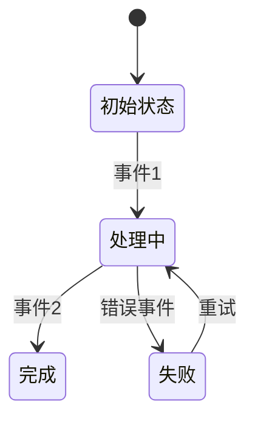

# HIS 知识库模式定义

## 角色定义
- **知识工程师**：负责知识库的架构设计、模式定义和质量控制
- **领域专家**：提供医疗业务知识，验证知识准确性
- **开发工程师**：使用知识库进行系统开发和问题排查
- **运维工程师**：使用知识库进行故障诊断和系统维护

## 模板系统

### 1. API 文档模板
```markdown
# [API名称] - [功能描述]

## 基本信息
- **接口类型**: HL7/HTTP/SOAP/其他
- **消息类型**: ADT^A01/ORM^O01/其他
- **触发条件**: [什么情况下调用此接口]
- **响应要求**: [同步/异步，超时时间]

## 消息结构
### 请求消息
```
MSH|^~\&|HIS|HOSPITAL|LIS|LAB|202507101430||ADT^A01|MSG001|P|2.5
PID|1||123456^^^HOSPITAL^MR||张伟^||19700101|M|||北京市朝阳区^||13800138000|||||||||||||||
PV1|1|I|301^3楼^01床^||||||||||||||||||||||||||||||||||||||20250710
```

### 响应消息
```
MSH|^~\&|LIS|LAB|HIS|HOSPITAL|202507101431||ACK^A01|MSG001|P|2.5
MSA|AA|MSG001
```

## 字段说明
| 字段 | 位置 | 名称 | 必填 | 格式 | 说明 | 示例 |
|------|------|------|------|------|------|------|
| MSH.9 | 1.9 | 消息类型 | 是 | ADT^A01 | 入院通知 | ADT^A01 |
| PID.3 | 2.3 | 患者ID | 是 | 字符串 | 患者唯一标识 | 123456 |
| PID.5 | 2.5 | 患者姓名 | 是 | 字符串 | 患者姓名 | 张伟 |

## 业务规则
1. 患者入院时自动触发
2. 必须在30分钟内收到LIS系统确认
3. 如果超时未收到确认，需要人工干预

## 错误处理
| 错误码 | 原因 | 处理建议 |
|--------|------|----------|
| AE | 应用程序错误 | 检查应用程序日志 |
| AR | 应用程序拒绝 | 验证权限配置 |

## 相关链接
- [住院子系统](/wiki/subsystems/inpatient/)
- [医嘱状态机](/wiki/patterns/pattern-order-lifecycle.md)
```

### 2. 模式文档模板
```markdown
# [模式名称] - [业务场景]

## 模式概述
[简要描述该模式解决的核心问题]

## 状态机图


## 状态说明
| 状态 | 编码 | 描述 | 允许操作 |
|------|------|------|----------|
| 初始 | 10 | 医嘱刚创建 | 提交、取消 |
| 处理中 | 20 | 正在执行 | 暂停、完成 |
| 完成 | 30 | 执行完成 | 归档 |

## 事件说明
| 事件 | 触发条件 | 前置状态 | 后置状态 | 业务逻辑 |
|------|----------|----------|----------|----------|
| 提交 | 医生确认 | 初始 | 处理中 | 生成执行计划 |
| 暂停 | 患者临时离开 | 处理中 | 暂停 | 记录暂停原因 |

## 实现要点
- [技术实现注意事项]
- [性能考虑]
- [扩展性设计]

## 使用场景
1. [场景1描述]
2. [场景2描述]

## 相关链接
- [API文档](/wiki/api/)
- [子系统文档](/wiki/subsystems/)
```

### 3. 故障案例模板
```markdown
# [故障编号] - [问题描述]

## 故障概述
- **发生时间**: 2025-07-10 14:30
- **影响范围**: 住院系统床位管理模块
- **严重程度**: P2（影响部分业务）
- **解决时间**: 2025-07-10 16:45

## 现象描述
[用户报告的具体现象]

## 排查过程
### 第一阶段：信息收集
1. 查看系统监控
2. 收集错误日志
3. 复现问题场景

### 第二阶段：根因分析
1. 分析日志关键信息
2. 定位问题代码
3. 验证假设

### 第三阶段：解决方案
1. 临时缓解措施
2. 永久修复方案
3. 验证修复效果

## 根因分析
[问题的根本原因]

## 解决方案
### 临时措施
[立即采取的缓解措施]

### 永久修复
[代码/配置/架构层面的修复]

## 预防措施
1. [监控改进]
2. [代码审查]
3. [测试覆盖]

## 经验总结
- [技术层面的收获]
- [流程层面的改进]

## 相关链接
- [API文档](/wiki/api/)
- [子系统文档](/wiki/subsystems/inpatient/)
```

## 标签系统
### 分类标签
- `#api` - 接口文档
- `#pattern` - 设计模式
- `#subsystem` - 子系统
- `#troubleshooting` - 故障排查
- `#business-rule` - 业务规则
- `#technical` - 技术实现

### 状态标签
- `#draft` - 草稿
- `#reviewed` - 已评审
- `#approved` - 已批准
- `#deprecated` - 已废弃

### 优先级标签
- `#p0` - 紧急/阻塞
- `#p1` - 高优先级
- `#p2` - 中优先级
- `#p3` - 低优先级

## 工作流程

### 1. 知识入库流程 (INGEST)
```
原始资料 → 提取整理 → 模板填充 → 同行评审 → 版本发布
```

### 2. 知识查询流程 (QUERY)
```
问题输入 → 标签过滤 → 语义搜索 → 结果排序 → 答案生成
```

### 3. 知识维护流程 (LINT)
```
定期检查 → 链接验证 → 内容更新 → 版本归档 → 过期清理
```

## 质量要求
1. **准确性**: 所有技术细节必须经过验证
2. **完整性**: 模板字段必须全部填写
3. **一致性**: 术语和格式保持统一
4. **可读性**: 结构清晰，示例丰富
5. **可维护性**: 便于更新和扩展

## 版本管理
- 使用语义化版本号：主版本.次版本.修订号
- 每次重大变更升级主版本
- 文档变更记录在日志中

---
*最后更新: 2025-04-15*
*维护者: 知识工程团队*