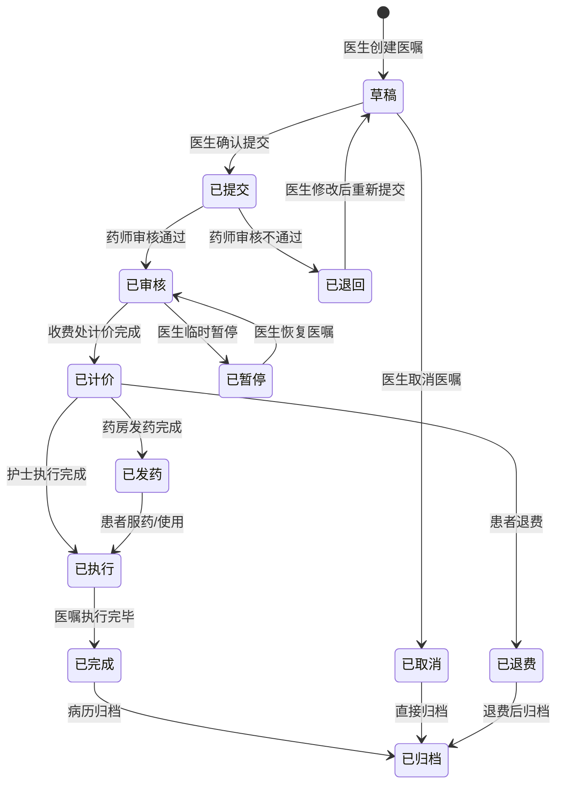

# 医嘱生命周期状态机 - 医疗医嘱全流程管理

## 模式概述
医嘱是医疗信息系统的核心业务对象，其生命周期管理涉及多个科室、多种状态和复杂的状态转换规则。本模式定义了医嘱从创建到归档的完整状态机，确保医嘱在不同系统间流转时状态一致性和业务完整性。

## 状态机图



## 状态说明

### 核心状态
| 状态 | 编码 | 描述 | 责任科室 | 允许操作 |
|------|------|------|----------|----------|
| 草稿 | 10 | 医生刚创建，未提交 | 医生站 | 提交、取消、修改 |
| 已提交 | 20 | 已提交待审核 | 药房 | 审核、退回 |
| 已审核 | 30 | 药师审核通过 | 收费处 | 计价、暂停 |
| 已计价 | 40 | 费用已计算 | 执行科室 | 发药、执行、退费 |
| 已发药 | 50 | 药品已发放 | 护士站 | 执行、退药 |
| 已执行 | 60 | 医嘱已执行 | 医生站 | 完成、补充执行 |
| 已完成 | 70 | 医嘱执行完毕 | 病案室 | 归档 |
| 已归档 | 80 | 已进入病历档案 | 归档系统 | 查询、统计 |

### 异常状态
| 状态 | 编码 | 描述 | 触发条件 | 处理方式 |
|------|------|------|----------|----------|
| 已取消 | 91 | 医嘱被取消 | 医生主动取消 | 直接归档 |
| 已退回 | 92 | 审核不通过 | 药师审核拒绝 | 返回修改 |
| 已暂停 | 93 | 临时暂停执行 | 患者临时离开 | 恢复后继续 |
| 已退费 | 94 | 费用已退还 | 患者退费申请 | 退费后归档 |

## 事件说明

### 医生操作事件
| 事件 | 触发条件 | 前置状态 | 后置状态 | 业务逻辑 |
|------|----------|----------|----------|----------|
| 创建医嘱 | 医生开立新医嘱 | [*] | 草稿 | 生成医嘱基本信息 |
| 提交医嘱 | 医生确认医嘱 | 草稿 | 已提交 | 验证必填字段，生成提交时间 |
| 取消医嘱 | 医生取消医嘱 | 草稿 | 已取消 | 记录取消原因，通知相关科室 |
| 修改医嘱 | 医生修改医嘱 | 草稿 | 草稿 | 保留修改历史，版本控制 |
| 恢复医嘱 | 医生恢复暂停医嘱 | 已暂停 | 已审核 | 记录恢复时间，重新进入流程 |
| 重新提交 | 医生修改后提交 | 已退回 | 已提交 | 标记为修改后提交，加快审核 |

### 药师操作事件
| 事件 | 触发条件 | 前置状态 | 后置状态 | 业务逻辑 |
|------|----------|----------|----------|----------|
| 审核通过 | 药师审核通过 | 已提交 | 已审核 | 记录审核人、时间，生成审核意见 |
| 审核退回 | 药师审核不通过 | 已提交 | 已退回 | 记录退回原因，通知医生修改 |
| 紧急审核 | 紧急医嘱快速审核 | 已提交 | 已审核 | 跳过部分检查，标记为紧急 |

### 收费操作事件
| 事件 | 触发条件 | 前置状态 | 后置状态 | 业务逻辑 |
|------|----------|----------|----------|----------|
| 计价完成 | 费用计算完成 | 已审核 | 已计价 | 生成费用明细，计算医保报销 |
| 退费处理 | 患者申请退费 | 已计价 | 已退费 | 计算应退金额，更新账户余额 |

### 药房操作事件
| 事件 | 触发条件 | 前置状态 | 后置状态 | 业务逻辑 |
|------|----------|----------|----------|----------|
| 发药完成 | 药品发放完成 | 已计价 | 已发药 | 更新库存，生成发药记录 |
| 退药处理 | 药品退回药房 | 已发药 | 已计价 | 恢复库存，生成退药记录 |

### 护士操作事件
| 事件 | 触发条件 | 前置状态 | 后置状态 | 业务逻辑 |
|------|----------|----------|----------|----------|
| 开始执行 | 开始执行医嘱 | 已计价/已发药 | 已执行 | 记录执行开始时间，执行人 |
| 执行完成 | 医嘱执行完毕 | 已执行 | 已完成 | 记录执行结束时间，执行结果 |
| 补充执行 | 补充执行记录 | 已执行 | 已执行 | 补充执行详情，标记为补充 |

## 实现要点

### 技术架构
```python
class MedicalOrderStateMachine:
    """医嘱状态机核心类"""
    
    def __init__(self, order_id):
        self.order_id = order_id
        self.current_state = 'draft'
        self.transition_history = []
    
    def transition(self, event, user, **kwargs):
        """执行状态转换"""
        # 验证转换规则
        if not self._is_valid_transition(event):
            raise InvalidTransitionError(f"无法从{self.current_state}转换到{event}")
        
        # 执行业务逻辑
        self._execute_business_logic(event, user, kwargs)
        
        # 更新状态
        old_state = self.current_state
        self.current_state = self._get_next_state(event)
        
        # 记录历史
        self._record_transition(old_state, self.current_state, event, user)
        
        # 触发后续操作
        self._trigger_post_actions(event, kwargs)
```

### 状态持久化
```sql
-- 医嘱状态表
CREATE TABLE medical_order_state (
    order_id VARCHAR(32) PRIMARY KEY,
    current_state VARCHAR(20) NOT NULL,
    current_state_code INT NOT NULL,
    last_transition_time TIMESTAMP NOT NULL,
    last_operator VARCHAR(50) NOT NULL,
    created_time TIMESTAMP NOT NULL DEFAULT CURRENT_TIMESTAMP,
    updated_time TIMESTAMP NOT NULL DEFAULT CURRENT_TIMESTAMP ON UPDATE CURRENT_TIMESTAMP
);

-- 状态转换历史表
CREATE TABLE order_transition_history (
    id BIGINT AUTO_INCREMENT PRIMARY KEY,
    order_id VARCHAR(32) NOT NULL,
    from_state VARCHAR(20) NOT NULL,
    to_state VARCHAR(20) NOT NULL,
    event VARCHAR(50) NOT NULL,
    operator VARCHAR(50) NOT NULL,
    transition_time TIMESTAMP NOT NULL DEFAULT CURRENT_TIMESTAMP,
    remark TEXT,
    INDEX idx_order_id (order_id),
    INDEX idx_transition_time (transition_time)
);
```

### 业务规则验证
1. **状态依赖验证**: 验证前置状态是否满足转换条件
2. **权限验证**: 验证操作人是否有权限执行该状态转换
3. **业务完整性验证**: 验证医嘱相关信息是否完整
4. **时效性验证**: 验证是否在允许的时间范围内操作

## 使用场景

### 场景1：正常医嘱流程
```
医生开立医嘱 → 提交审核 → 药师审核 → 收费计价 → 药房发药 → 护士执行 → 完成归档
```
**适用医嘱类型**: 普通药品医嘱、检查医嘱、治疗医嘱

### 场景2：紧急医嘱流程
```
医生开立紧急医嘱 → 紧急提交 → 药师快速审核 → 护士先执行后补流程
```
**适用医嘱类型**: 抢救药品、紧急检查、急诊治疗

### 场景3：停止医嘱流程
```
医生停止长期医嘱 → 系统自动停止未执行部分 → 记录停止原因 → 归档
```
**适用医嘱类型**: 长期医嘱、输液医嘱、呼吸机参数

### 场景4：退费退药流程
```
患者申请退费 → 收费处退费处理 → 药房退药处理 → 更新库存 → 归档
```
**适用医嘱类型**: 未执行药品、检查取消、治疗中止

## 性能考虑

### 状态查询优化
1. **缓存策略**: 高频查询的状态信息使用Redis缓存
2. **索引优化**: 状态转换历史表建立复合索引
3. **分表策略**: 按时间范围对历史表进行分表

### 并发处理
1. **乐观锁**: 使用版本号防止状态覆盖
2. **队列处理**: 高并发时使用消息队列异步处理
3. **限流策略**: 对状态转换接口进行限流保护

## 扩展性设计

### 插件化状态机
```python
class OrderStateMachinePlugin:
    """状态机插件接口"""
    
    def before_transition(self, order, event, user):
        """转换前钩子"""
        pass
    
    def after_transition(self, order, event, user):
        """转换后钩子"""
        pass
    
    def validate_transition(self, order, event, user):
        """自定义验证规则"""
        pass
```

### 可配置状态规则
```yaml
# order_state_rules.yaml
states:
  draft:
    code: 10
    description: 草稿状态
    allowed_events: [submit, cancel, modify]
    
  submitted:
    code: 20
    description: 已提交
    allowed_events: [approve, reject]
    
transitions:
  submit:
    from: draft
    to: submitted
    validators: [required_fields, patient_status]
    actions: [notify_pharmacy, generate_submit_time]
```

## 相关链接
- [ADT^A01入院通知接口](/wiki/api/api-hl7-adt-a01.md) `#api` `#hl7`
- [住院子系统](/wiki/subsystems/inpatient/) `#subsystem` `#inpatient`
- [药品库存管理模式](/wiki/patterns/pattern-drug-inventory.md) `#pattern` `#inventory`

## 版本历史
| 版本 | 日期 | 修改内容 | 修改人 |
|------|------|----------|--------|
| 1.0.0 | 2025-04-15 | 初始创建 | 系统 |
| 1.0.1 | 2025-04-15 | 增加Mermaid状态图 | 系统 |

---

**维护团队**: 业务架构组  
**最后更新**: 2025-04-15  
**文档状态**: `#approved` `#pattern` `#state-machine` `#order` `#business-rule`