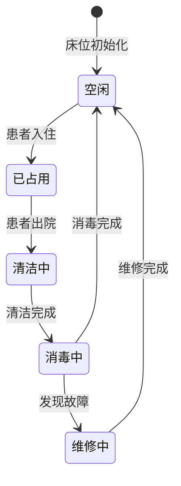

# 住院子系统 - 医院住院业务核心系统

## 系统概述
住院子系统是医院信息系统的核心组成部分，负责管理患者从入院到出院的完整业务流程。系统涵盖床位管理、医嘱处理、护理记录、费用结算等关键功能，为医护人员提供全面的住院患者管理工具。

## 系统架构

### 功能模块图
```
住院子系统
├── 患者管理模块
│   ├── 入院登记
│   ├── 患者信息维护
│   ├── 转科转床
│   └── 出院办理
├── 床位管理模块
│   ├── 床位资源管理
│   ├── 床位分配调度
│   ├── 床位状态监控
│   └── 床位使用统计
├── 医嘱管理模块
│   ├── 医嘱开立
│   ├── 医嘱审核
│   ├── 医嘱执行
│   └── 医嘱停止
├── 护理管理模块
│   ├── 护理评估
│   ├── 护理计划
│   ├── 护理记录
│   └── 护理交班
├── 费用管理模块
│   ├── 费用预交
│   ├── 实时计费
│   ├── 费用查询
│   └── 出院结算
└── 统计报表模块
    ├── 床位使用率
    ├── 平均住院日
    ├── 费用构成分析
    └── 医疗质量指标
```

### 技术架构
```yaml
技术栈:
  前端: Vue 3 + Element Plus + TypeScript
  后端: Spring Boot 3 + MyBatis Plus + Java 17
  数据库: MySQL 8.0 (主) + Redis 7.0 (缓存)
  消息队列: RabbitMQ 3.12
  容器化: Docker + Kubernetes
  监控: Prometheus + Grafana
  日志: ELK Stack (Elasticsearch, Logstash, Kibana)
```

## 核心功能

### 1. 患者管理

#### 入院登记流程
```
患者到达 → 身份验证 → 基本信息录入 → 医保信息登记 → 预交金缴纳 → 床位分配 → 生成住院号 → 完成入院
```

#### 关键数据模型
```sql
-- 患者主表
CREATE TABLE inpatient_patient (
    patient_id VARCHAR(32) PRIMARY KEY COMMENT '患者ID',
    inpatient_no VARCHAR(20) UNIQUE NOT NULL COMMENT '住院号',
    name VARCHAR(50) NOT NULL COMMENT '患者姓名',
    gender CHAR(1) NOT NULL COMMENT '性别',
    birth_date DATE NOT NULL COMMENT '出生日期',
    id_card VARCHAR(18) COMMENT '身份证号',
    phone VARCHAR(20) COMMENT '联系电话',
    address VARCHAR(200) COMMENT '联系地址',
    emergency_contact VARCHAR(50) COMMENT '紧急联系人',
    emergency_phone VARCHAR(20) COMMENT '紧急联系电话',
    admission_time DATETIME NOT NULL COMMENT '入院时间',
    discharge_time DATETIME COMMENT '出院时间',
    current_status VARCHAR(20) NOT NULL COMMENT '当前状态',
    created_time DATETIME NOT NULL DEFAULT CURRENT_TIMESTAMP,
    updated_time DATETIME NOT NULL DEFAULT CURRENT_TIMESTAMP ON UPDATE CURRENT_TIMESTAMP
);

-- 入院记录表
CREATE TABLE admission_record (
    record_id BIGINT AUTO_INCREMENT PRIMARY KEY,
    patient_id VARCHAR(32) NOT NULL COMMENT '患者ID',
    admission_diagnosis TEXT COMMENT '入院诊断',
    admission_symptoms TEXT COMMENT '入院症状',
    vital_signs JSON COMMENT '生命体征',
    attending_doctor VARCHAR(50) NOT NULL COMMENT '主治医生',
    department_id VARCHAR(20) NOT NULL COMMENT '入院科室',
    bed_id VARCHAR(20) NOT NULL COMMENT '床位ID',
    admission_type VARCHAR(20) NOT NULL COMMENT '入院类型',
    payment_type VARCHAR(20) NOT NULL COMMENT '付费方式',
    prepayment_amount DECIMAL(10,2) NOT NULL COMMENT '预交金额',
    remark TEXT COMMENT '备注',
    created_time DATETIME NOT NULL DEFAULT CURRENT_TIMESTAMP
);
```

### 2. 床位管理

#### 床位状态机


#### 床位分配算法
```python
class BedAllocationAlgorithm:
    """智能床位分配算法"""
    
    def allocate_bed(self, patient, requirements):
        """
        分配床位
        :param patient: 患者信息
        :param requirements: 床位要求
        :return: 分配的床位信息
        """
        # 1. 过滤可用床位
        available_beds = self._get_available_beds()
        
        # 2. 应用业务规则过滤
        filtered_beds = self._apply_business_rules(available_beds, patient, requirements)
        
        # 3. 优先级排序
        sorted_beds = self._sort_by_priority(filtered_beds, patient)
        
        # 4. 选择最优床位
        optimal_bed = self._select_optimal_bed(sorted_beds)
        
        return optimal_bed
    
    def _apply_business_rules(self, beds, patient, requirements):
        """应用业务规则"""
        rules = [
            self._rule_same_gender_ward,      # 同性别病区
            self._rule_age_group_match,       # 年龄组匹配
            self._rule_isolation_requirement, # 隔离要求
            self._rule_special_care_need,     # 特殊护理需求
            self._rule_proximity_to_nurse,    # 靠近护士站
            self._rule_family_request,        # 家属要求
        ]
        
        for rule in rules:
            beds = rule(beds, patient, requirements)
            if not beds:
                break
        
        return beds
```

### 3. 医嘱管理
与 [医嘱生命周期状态机](/wiki/patterns/pattern-order-lifecycle.md) 深度集成，提供完整的医嘱处理能力。

### 4. 护理管理

#### 护理工作流
```
护理评估 → 护理诊断 → 护理计划 → 护理实施 → 护理评价 → 护理记录
```

#### 护理记录模板
```json
{
  "record_id": "NR20250715001",
  "patient_id": "P20250710001",
  "nurse_id": "N001",
  "record_time": "2025-07-15 08:00:00",
  "record_type": "routine",
  "vital_signs": {
    "temperature": 36.5,
    "pulse": 72,
    "respiration": 18,
    "blood_pressure": "120/80",
    "spo2": 98
  },
  "nursing_measures": [
    {
      "measure": "生命体征监测",
      "frequency": "q4h",
      "result": "稳定"
    },
    {
      "measure": "药物注射",
      "drug": "头孢曲松钠",
      "dose": "2g",
      "route": "iv",
      "time": "08:00"
    }
  ],
  "special_observations": "患者情绪稳定，配合治疗",
  "next_plan": "继续当前治疗方案，注意观察药物反应"
}
```

### 5. 费用管理

#### 实时计费流程
```
医疗行为发生 → 触发计费事件 → 费用项目匹配 → 价格计算 → 医保分解 → 个人账户扣款 → 更新余额
```

#### 费用构成分析
```sql
-- 费用分类统计
SELECT 
    fee_category AS '费用类别',
    COUNT(*) AS '项目数量',
    SUM(amount) AS '总金额',
    ROUND(SUM(amount) / total.total_amount * 100, 2) AS '占比(%)'
FROM inpatient_fee_detail
CROSS JOIN (SELECT SUM(amount) AS total_amount FROM inpatient_fee_detail) total
WHERE patient_id = 'P20250710001'
  AND fee_date BETWEEN '2025-07-10' AND '2025-07-15'
GROUP BY fee_category
ORDER BY SUM(amount) DESC;
```

## 系统集成

### 内部集成
| 集成系统 | 集成方式 | 主要接口 | 同步频率 |
|----------|----------|----------|----------|
| 门诊系统 | 消息队列 | 患者基本信息同步 | 实时 |
| 药房子系统 | HL7 | 药品医嘱、发药确认 | 实时 |
| 检验系统 | HL7 | 检验申请、结果回报 | 实时 |
| 影像系统 | HL7 | 检查申请、报告回报 | 实时 |
| 收费系统 | 数据库直连 | 费用同步、结算数据 | 实时 |

### 外部集成
| 集成系统 | 集成方式 | 主要功能 | 协议标准 |
|----------|----------|----------|----------|
| 医保系统 | WebService | 医保结算、目录对照 | 国家标准 |
| 区域平台 | HTTP API | 数据上报、信息共享 | 区域标准 |
| 银行系统 | 银联接口 | 费用支付、对账 | 金融标准 |

## 性能指标

### 业务性能
| 指标 | 目标值 | 监控频率 | 报警阈值 |
|------|--------|----------|----------|
| 入院登记时间 | ≤3分钟/人 | 实时 | >5分钟 |
| 床位分配时间 | ≤30秒 | 实时 | >60秒 |
| 医嘱处理延迟 | ≤5秒 | 实时 | >10秒 |
| 费用计算延迟 | ≤2秒 | 实时 | >5秒 |
| 系统可用性 | ≥99.9% | 每分钟 | <99.5% |

### 技术性能
| 指标 | 目标值 | 当前值 | 状态 |
|------|--------|--------|------|
| API响应时间(P95) | ≤200ms | 150ms | ✅ |
| 数据库查询时间 | ≤100ms | 80ms | ✅ |
| 并发用户数 | ≥1000 | 500 | ⚠️ |
| 数据存储容量 | ≥5TB | 2TB | ⚠️ |

## 部署架构

### 生产环境部署
```yaml
部署拓扑:
  负载均衡层: Nginx × 2 (主备)
  应用服务器: Tomcat × 4 (集群)
  数据库层: MySQL主从 × 3 (一主两从)
  缓存层: Redis集群 × 6 (三主三从)
  消息队列: RabbitMQ集群 × 3
  文件存储: MinIO集群 × 4
  监控告警: Prometheus + AlertManager
```

### 高可用设计
1. **应用层高可用**: Nginx负载均衡 + 应用集群
2. **数据层高可用**: MySQL主从复制 + 自动故障转移
3. **缓存层高可用**: Redis集群 + 数据分片
4. **网络层高可用**: 多线路接入 + BGP路由

## 运维管理

### 日常维护任务
| 任务 | 频率 | 执行时间 | 负责人 |
|------|------|----------|--------|
| 数据库备份 | 每日 | 02:00-03:00 | DBA |
| 日志清理 | 每周 | 周日 01:00-02:00 | 运维 |
| 性能监控 | 实时 | 全天 | 监控系统 |
| 安全扫描 | 每月 | 每月第一周 | 安全团队 |

### 应急预案
| 场景 | 影响程度 | 响应时间 | 恢复步骤 |
|------|----------|----------|----------|
| 数据库故障 | P0 | ≤5分钟 | 1. 切换备库 2. 修复主库 3. 数据同步 |
| 应用服务器宕机 | P1 | ≤10分钟 | 1. 流量切走 2. 重启服务 3. 原因分析 |
| 网络中断 | P0 | ≤3分钟 | 1. 切换线路 2. 网络排查 3. 恢复主线路 |
| 数据异常 | P1 | ≤30分钟 | 1. 停止写入 2. 数据修复 3. 验证恢复 |

## 相关链接
- [ADT^A01入院通知接口](/wiki/api/api-hl7-adt-a01.md) `#api` `#hl7`
- [医嘱生命周期状态机](/wiki/patterns/pattern-order-lifecycle.md) `#pattern` `#state-machine`
- [床位冲突问题](/wiki/troubleshooting/issue-20250710-bed-conflict.md) `#troubleshooting` `#bed`

## 版本历史
| 版本 | 日期 | 修改内容 | 修改人 |
|------|------|----------|--------|
| 1.0.0 | 2025-04-15 | 初始创建 | 系统 |
| 1.0.1 | 2025-04-15 | 完善技术架构 | 系统 |

---

**维护团队**: 住院系统开发组  
**最后更新**: 2025-04-15  
**文档状态**: `#approved` `#subsystem` `#inpatient` `#ward` `#technical`